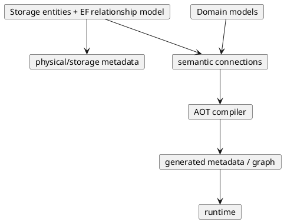
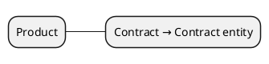
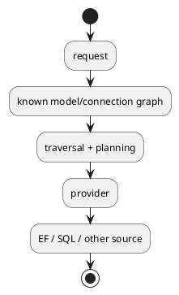

# AOT metadata and connections

Foundgine's AOT path moves stable domain knowledge out of the request path.



## Important boundary

Foundgine does **not** generate or populate entity/model objects.

- EF remains the authority for entity schema, keys, foreign keys, and database relationships.
- A Foundgine model describes application-facing data semantics.
- A connection describes that a model can **visit** a known target entity.
- The runtime follows the generated connection; it does not discover the relationship.

This deliberately avoids becoming an object mapper or a second ORM.

## Connections

A model can declare a semantic connection:

```csharp
[FoundgineModel]
public sealed class Product
{
    [FoundgineConnection(typeof(Contract))]
    public Contract Contract => throw new NotSupportedException();
}
```

The property is a declaration of topology. Foundgine never evaluates it and never constructs a `Contract`.

The generator emits:



Relational key details remain on the storage side. This is intentional: a connection says **what may be visited**, while EF/entity metadata says **how the storage relationship exists**.

## Mapping direction

Field correspondence should remain convention-first. When a model and entity need explicit semantic correspondence, the intended next layer is ordinary C#/LINQ expression analysis at build time. Those expressions describe a plan; they are not runtime mappers.

Special conversions such as `ProductType → ContractType` should therefore be represented as compile-time transformations in the mapping IR, rather than requiring generated entity/model population.

## Runtime goal



The expensive discovery work belongs in AOT. Runtime should bind request-specific values and execute the already-known topology.

---

Next: [Public API](PUBLIC-API.md)
