# Architecture

Foundgine is a semantic execution layer between application intent and physical execution.

The central architectural rule is:

> **Callers describe intent. The semantic model defines meaning. Authorization determines authority. Planning defines logical execution. Providers define physical execution.**

## Canonical pipeline

<p align="center">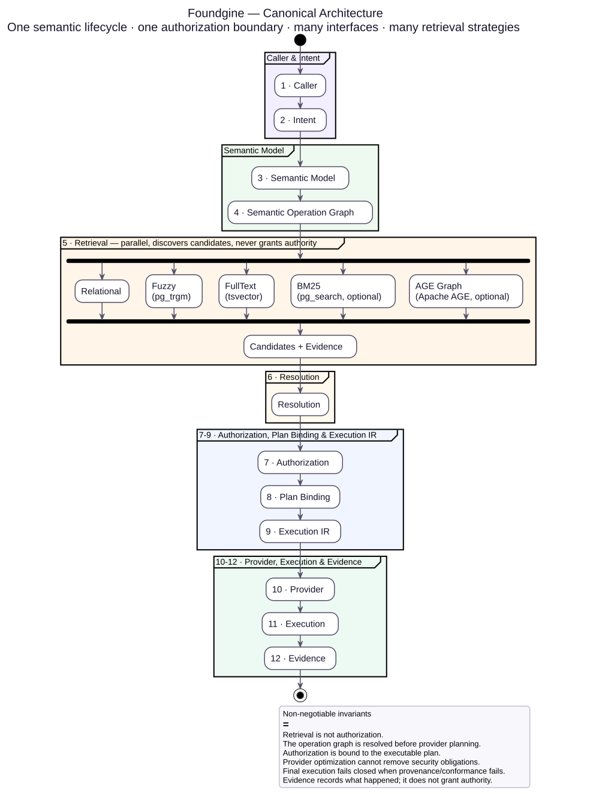</p>

The canonical lifecycle is: **Caller → Intent → Semantic Model → Semantic Operation Graph → Retrieval → Resolution → Authorization → Plan Binding → Execution IR → Provider → Execution → Evidence**. Other pages may focus on individual stages, but they must preserve this ordering.

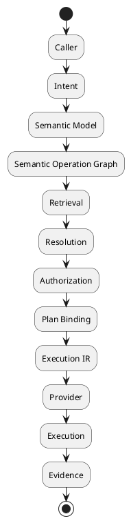

## Semantic Operation Graph → Authorization → Plan Binding → Execution

The semantic operation graph is the canonical security object for a resolved request. It makes the requested topology explicit before planning and gives authorization one complete object to evaluate rather than a collection of transport-specific fragments.

The lifecycle is deliberately monotonic:

```plantuml
@startmindmap
* Caller / transport
* ↓
* Intent
* ↓
* Semantic resolution
* ↓
* Semantic Operation Graph
* ↓
* Graph validation + resource limits
* ↓
* Authorization against the immutable semantic contract
* ↓
* Authorized Operation Graph + Authorization Evidence
* ↓
* Provider-independent Semantic Plan
* │
**** AuthorizationBinding
***** ContractFingerprint
***** AuthorizationFingerprint
* ↓
* Security-preserving rewrites / optimization
* ↓
* ExecutionIR
* ↓
* Provider plan + provider security proof
* ↓
* Final execution gate
* ↓
* Provider execution
* ↓
* Result + evidence
@endmindmap
```

### The graph is the security unit

`SemanticOperationGraph` represents the complete resolved operation topology: root and child nodes, fields, relationships/connections and semantic query constraints. Graph validation and resource limits run before expensive planning or provider work.

Authorization evaluates the complete graph against the trusted immutable `SemanticContractSnapshot`. For graph authorization, the provider is absent from the decision boundary. A successful decision produces both an authorized graph and immutable authorization evidence.

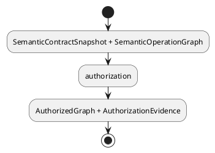

Retrieval strategies such as relational lookup, fuzzy search, full-text search, BM25 or Apache AGE may help resolve ambiguous references, but they only produce candidates and evidence. They never become the authority over which graph nodes may be exercised.

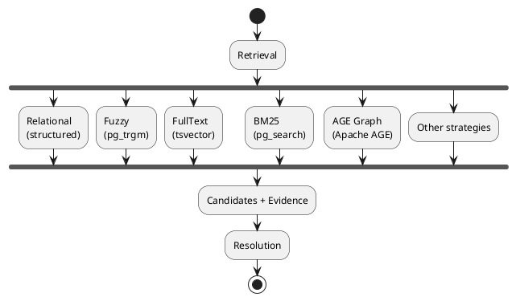

### Plan binding is provenance, not a second authorization system

When an authorized operation is planned, the resulting `SemanticPlan` carries a `SemanticPlanAuthorizationBinding`. The binding records the fingerprints of the exact semantic contract and authorization decision that produced the plan.

```plantuml
@startmindmap
* SemanticPlan
* │
** AuthorizationBinding
**** contract fingerprint
**** authorization fingerprint
@endmindmap
```

Planner rewrites are required to preserve this binding. A rewrite that adds, removes, or changes the authorization provenance is rejected rather than silently producing an authorization-free plan.

This means optimization can change execution shape without changing the authority under which that shape was created.

### ExecutionIR is the next trust boundary

`ExecutionIR` is produced only from a plan carrying authorization provenance. Before it is accepted for provider compilation, the binding can be checked against the same semantic contract and authorization evidence.

The provider plan then inherits the same binding. The final execution gate additionally requires a provider security proof bound to the exact provider plan and exact `ExecutionIR`.

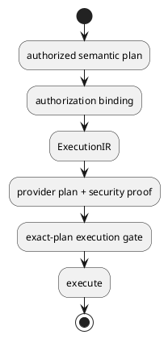

The important invariant is:

> **An executable provider artifact must remain traceably bound to the semantic contract and authorization decision that produced it.**

Changing the contract, authorization evidence, execution IR, provider, or security proof breaks that chain and causes execution to fail closed.

### Reads and mutations share the boundary model

Reads use `SemanticOperationGraph` → `SemanticPlan` → `ExecutionIR`. Mutations use `SemanticMutationOperationGraph` → mutation planning → execution security/conformance, with the same principle: semantic meaning is resolved and authorized before provider-specific work, and execution artifacts retain security provenance.

This is why GraphQL, MCP, JSON, AI tools and direct C# callers do not need separate authorization architectures. They converge before the security-sensitive planning boundary.


## Layer 1 — Intent

Intent is what the caller wants.

Supported entry surfaces include:

- typed fluent C#;
- dynamic fluent C#;
- JSON;
- GraphQL adapters;
- MCP;
- Microsoft.Extensions.AI tool integration;
- semantic mutation builders.

Intent is untrusted input.

## Layer 2 — Semantics

`Foundgine.Semantics` defines application meaning:

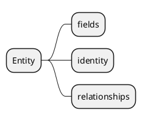

It also defines request graphs, filters, ordering, pagination, logical traversals, mutation semantics, capability descriptions, and security context contracts.

The semantic model is not the database schema.

## Layer 3 — Metadata

`Foundgine.Metadata` describes structural facts:

```text
entities
fields
primary keys
columns
direct relationships
model mappings
connections
conversions
```

Metadata can be generated by `Foundgine.Aot.Generator`.

The important distinction is:

```text
Metadata = what structurally exists
Semantics = what the application means/exposes
```

## Layer 4 — Authorization

Authorization is applied to resolved semantic meaning.

The policy can constrain:

- entities;
- fields;
- relationships;
- read/write operations;
- conditional resource predicates.

Authorization is not a GraphQL concern, SQL concern, or AI concern.

A transport can help construct intent but cannot grant authority.

## Layer 5 — Planning

`Foundgine.Planning` turns authorized semantic operations into a provider-independent logical plan.

A read plan contains topology such as:

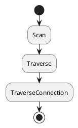

and semantic clauses such as filtering, ordering and pagination.

The plan must not contain SQL.

## Layer 6 — Rewriting and optimization

The planner can apply conservative rewrites.

A rewrite must preserve:

```text
semantic meaning
+
authorization
+
required security invariants
```

Where aggregate semantics or provider capabilities matter, explicit proof/capability gates are used.

Provider cost estimates are advisory only.

## Layer 7 — Execution

`Foundgine.Execution` is the physical execution boundary.

It provides:

- `ExecutionIR`;
- provider compiler contracts;
- provider execution contracts;
- result materialization;
- execution evidence;
- provider security conformance;
- execution-time authorization revalidation;
- mutation execution coordination.

## Layer 8 — Providers

Current providers include:

```text
Foundgine.Sql
Foundgine.InMemory
```

Alongside the execution providers, two optional lexical-grounding candidate
providers plug into the resolution layer without either depending on the
other: `Foundgine.Elasticsearch` and `Foundgine.Postgres.Vector`.

SQL lowers the plan into parameterized SQL and executes through ADO.NET.

InMemory executes a deliberately limited subset over CLR-backed rows.

The existence of both providers is an architectural test: the logical plan cannot depend on SQL-specific concepts.

### Retrieval strategies inside the SQL provider

Semantic resolution sometimes needs ranked candidates for an ambiguous reference — a name that doesn't exactly match, a fuzzy search term, or a "find things related to this" request. `Foundgine.Sql` answers that through PostgreSQL mechanisms selected per request, all behind the same provider-neutral `RetrievalStrategy` contract:

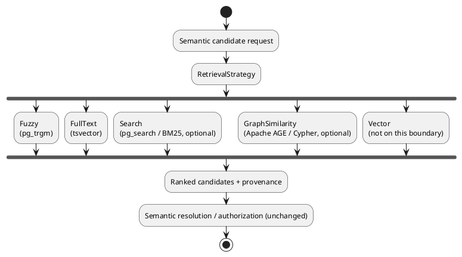

`Fuzzy` and `FullText` use PostgreSQL's built-in `pg_trgm` and `tsvector`/`websearch_to_tsquery`. `Search` and `GraphSimilarity` are optional and require the `pg_search` and Apache AGE extensions respectively — `GraphSimilarity` runs a Cypher query through AGE over a semantic relationship (for example, finding suppliers similar to a given one by shared purchase-order neighbors) and returns ranked candidates, the same shape as any other strategy. `Vector` is not implemented on this per-field `IApproximateCandidateSource` boundary; token-level vector retrieval instead lives in `Foundgine.Postgres.Vector`, a `pgvector`-backed implementation of the separate `ISemanticLexicalCandidateSource` boundary used by lexical grounding (see below and [`LEXICAL-GROUNDING.md`](LEXICAL-GROUNDING.md)).

Retrieval only ever produces candidates and evidence. It does not bypass semantic resolution, authorization, or planning — a candidate still has to resolve to a real semantic entity and pass authorization before it can appear in a plan.

## Transport adapters

Transport packages remain thin:

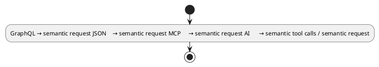

They do not become alternate planners.

## Security context

Authority is host-owned.

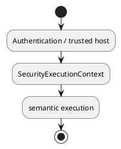

GraphQL variables, JSON properties, MCP arguments, and model-generated tool arguments must not be treated as authoritative identity/tenant/warrant material.

## Logical traversal

A semantic traversal can hide intermediate edges:

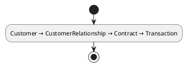

as:

```text
Customer.transactions
```

Resolution expands the path before authorization.

This prevents a shortcut from bypassing a denied intermediate entity or relationship.

## Mutations

Mutation semantics have their own algebra because writes require dependency, generated-value, approval, and security handling.

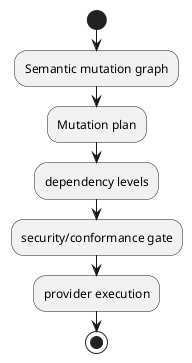

GraphQL mutation translation, MCP mutation tools, and direct mutation authoring all converge on this boundary.

## AOT

The AOT architecture moves stable topology into compilation:

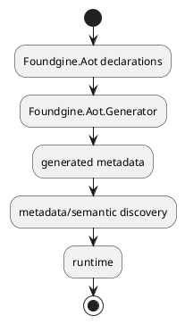

This reduces runtime discovery work and supports Native AOT-friendly metadata handling.

It does not make arbitrary provider/application dependencies automatically Native-AOT compatible.

## Optional authority recovery

`Foundgine.Security.Authority` is deliberately outside the core.

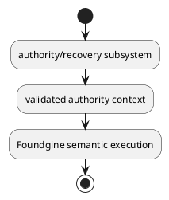

Applications that do not need a distributed authorization authority/recovery control plane do not need this package.

## Dependency direction

The intended package structure is:

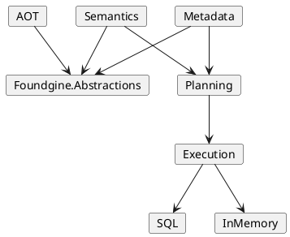

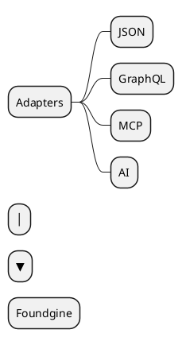

The exact project-reference graph contains additional supporting dependencies, but this is the architectural direction.

## What Foundgine is not

Foundgine is not intended to be:

- an ORM;
- a GraphQL server;
- an AI agent framework;
- an authorization server;
- a workflow engine;
- a database engine;
- a generic SQL builder.

Its purpose is the boundary between semantic intent and controlled execution.

---

Next: [Metadata → Semantics](METADATA-TO-SEMANTICS.md)

## Lexical grounding: retrieval proposes, semantics decides

Free-form language is resolved through a provider-neutral lexical candidate
boundary. Each token may be searched against every semantic kind (entity, node,
relationship, traversal, field, value, or operation). The highest retrieval
score is the first hypothesis, not truth.

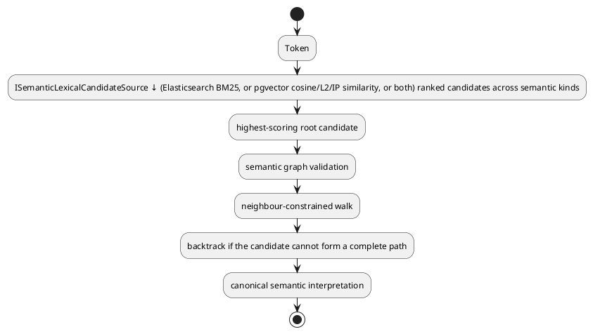

The semantic graph is authoritative for topology. Approximate retrieval scores
never authorize a path and are never treated as probabilities. Database/provider
execution begins only after semantic resolution and authorization.
`Foundgine.Elasticsearch` and `Foundgine.Postgres.Vector` are two
interchangeable implementations of `ISemanticLexicalCandidateSource`; the
semantic layer depends on neither directly, and a deployment may use one,
the other, or both.

### A legal path is not necessarily the intended one

"Canonical semantic interpretation" above still only answers *is this
mapping legal*. It does not answer *is this mapping what the caller meant*,
and those can come apart: a single expression can be structurally valid
against two different fields, values, relationships, or root entities at
once, and retrieval score alone cannot break that tie in a principled way.

`SemanticLexicalResolver.Ground` inserts one more decision between
"canonical semantic interpretation" and authorization: it groups candidate
paths by what they actually mean (ignoring score and bridging route), and
only commits automatically when either one meaning dominates or the
remaining candidates all agree on that meaning. When two or more distinct
meanings remain within confidence range of each other, it returns
`GroundingOutcome.RequiresClarification` instead of authorizing whichever
one happened to score highest — see [Grounding decisions](GROUNDING-DECISIONS.md).
