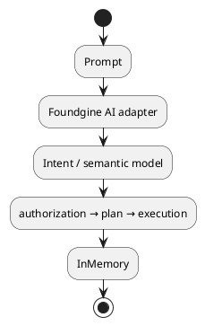

# Foundgine.Agent.OpenAI

The smallest useful AI example: one semantic `Customer` model, one in-memory provider, and one agent adapter.



The sample is intentionally lean. It demonstrates the boundary; it is not a mini application.

## Run

```bash
set OPENAI_API_KEY=...
dotnet run --project samples/Foundgine.Agent.OpenAI
```
