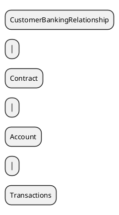
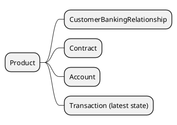

# Foundgine.CoffeeBeanery.ProductComposite

A focused deep dive into a **composite application model**.

CoffeeBeanery stores the underlying banking concepts separately:

The application-facing `Product` is composed from four different entities:

The important architectural point is that `Product` is **not another storage entity**. The semantic model describes the application-facing contract while the source entities remain independent. A real provider can later resolve the composition through SQL joins, APIs, caches, or other providers.

This sample intentionally stops at the semantic/composition boundary.
