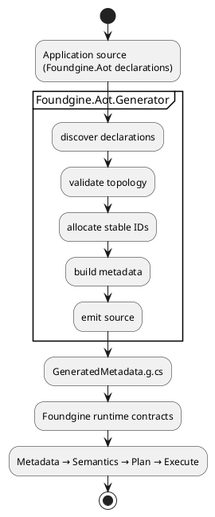
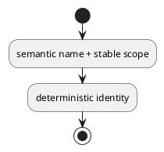
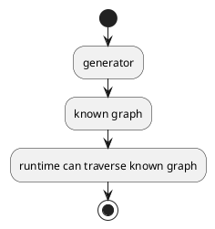

# Foundgine.Aot.Generator

`Foundgine.Aot.Generator` is the Roslyn incremental source generator for Foundgine AOT metadata.

It is **compile-time infrastructure**, not a runtime query engine.

## Pipeline



## Why a source generator?

Stable application metadata should not need to be reconstructed from runtime reflection on every application start/request.

The generator can discover declarations at build time and emit ordinary C# source that implements the required metadata contracts.

Benefits include:

- predictable startup;
- Native AOT-friendly architecture;
- compile-time validation;
- deterministic generated identities;
- fewer runtime discovery dependencies.

## Incremental generation

The generator is implemented as a Roslyn incremental generator so it can participate efficiently in normal compiler builds.

It analyses the consuming compilation rather than requiring the application to manually enumerate every declaration.

## What it discovers

The generator understands the declarations from `Foundgine.Aot`, including:

- entities;
- fields;
- relationships;
- models;
- connections;
- mappings;
- conversions;
- authorization metadata;
- semantic dimensions;
- aliases;
- event metadata.

## Validation

Generation is intentionally a validation boundary.

The generator should reject structurally inconsistent declarations rather than emitting metadata that can only fail later.

Examples include:

```text
invalid entity identity
duplicate field/relationship identity
unknown relationship target
invalid key correspondence
inconsistent declaration topology
```

## Identity generation

Stable identity is important because generated metadata participates in semantic graph identity and plan/cache fingerprints.

The generator therefore uses deterministic semantic inputs where an identity is derived rather than depending on incidental source order.

For example:



Do not use line number, property position, or file ordering as a long-lived identity unless the contract explicitly says that it is positional.

## Generated output

The generator emits source consumed by the application compilation.

The exact generated source is an implementation detail; applications should consume the generated metadata through the normal Foundgine metadata/semantic contracts rather than depending on generated class internals.

## Records and normal CLR types

The generator supports normal C# domain declarations, including record types used by the repository's semantic samples.

Generated metadata describes the type. It does not instantiate domain objects.

## Relationship topology

A relationship is generated as metadata describing topology and key correspondence.

A semantic connection is likewise a declaration of reachable topology.

This distinction is important:



Runtime execution does not need to inspect a navigation property and invoke it as an object graph.

## Generated field helpers

The companion `Foundgine.Aot` package contains extensions that make generated semantic fields convenient to use for common operations such as:

- equality;
- inequality;
- membership;
- ordering;
- mutation assignment.

The generator supplies the field identity; the helper constructs semantic intent.

## Debugging generation

When diagnosing generated metadata:

1. inspect the declaration that produced the metadata;
2. check generator diagnostics/build errors;
3. inspect generated source if necessary;
4. verify the generated identity/topology against the semantic model;
5. test resolution rather than testing generated text alone.

The generated source is an implementation artifact; the semantic contract is the behavior that matters.

## What this project does not do

It does not:

- execute queries;
- generate SQL;
- authorize users;
- parse GraphQL;
- expose MCP;
- call an LLM;
- act as an ORM/source-code mapper.

## Dependencies

The generator targets `netstandard2.0` and consumes Roslyn compiler APIs.

Applications normally reference `Foundgine.Aot` for declarations and receive the generator through the package/build integration rather than constructing the generator manually.

## Related packages

- `Foundgine.Aot` — application declarations.
- `Foundgine.Metadata` — metadata contracts.
- `Foundgine.Semantics` — semantic model.
- `Foundgine` — runtime.

## Target framework

- `netstandard2.0` generator
- Roslyn incremental generator
- MIT licensed
