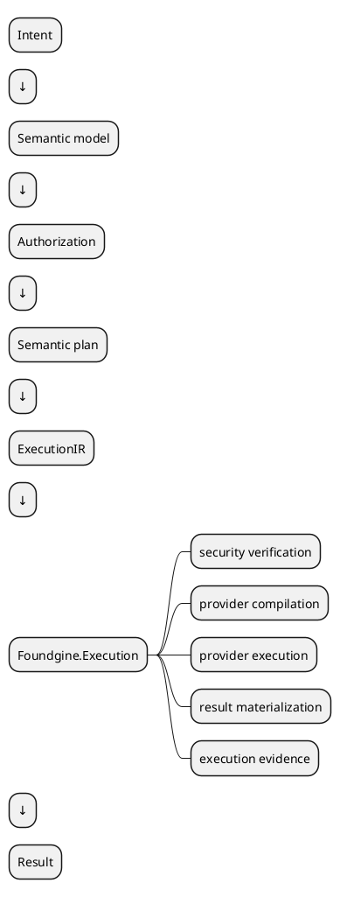
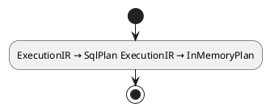
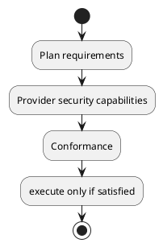
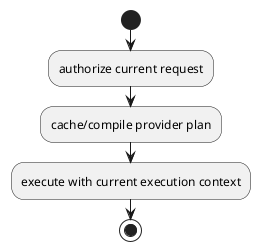
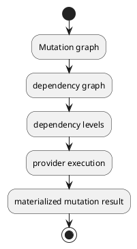
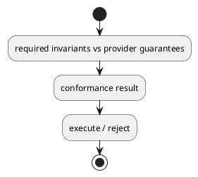

# Foundgine.Execution

`Foundgine.Execution` is the provider execution boundary.

It takes a provider-independent plan, verifies the execution security contract, compiles/executes through a provider, materializes the result, and produces execution evidence.

## Boundary

This package is deliberately below semantics/planning and above physical providers.

## Core contracts

### `IExecutionProvider`

The provider execution contract receives a provider plan and execution context and returns an `ExecutionResult`.

A provider owns physical execution details.

### `IProviderPlanCompiler`

Compiles provider-independent execution IR/plans into a provider-specific plan.

Examples:

### Mutation provider contracts

Mutation execution has explicit contracts for:

- single-operation execution;
- batched mutation execution;
- security conformance evaluation.

This keeps nested/batched writes out of the read provider contract.

## Execution IR

`ExecutionIR` is the canonical runtime representation between planning and provider compilation.

It is designed to preserve:

- semantic identity;
- logical topology;
- projections;
- query constraints;
- authorization requirements;
- execution/security obligations.

The provider is then free to lower that IR into SQL, in-memory operations, or another physical representation.

## Security gates

Execution is not a blind pass-through.

Security-related types include:

- `SecurityInvariantExecutionGate`;
- `SecurityInvariantProofGate`;
- `SecurityInvariantAttestation`;
- `SecurityInvariantProof`;
- `IExecutionAuthorizationRevalidator` / `SemanticExecutionAuthorizationRevalidator`;
- `ExecutionAuthorizationAuthorityState`;
- provider security conformance contracts.

The objective is to prevent a provider from executing a plan whose required security guarantees it cannot preserve.

Conceptually:

## Execution context

`ExecutionContext` is request-scoped runtime information.

It can carry:

- security execution data;
- authorization values;
- request/provider context;
- execution limits and other runtime values.

It must remain host-controlled when it contains authority.

An untrusted transport should never be able to replace a host-owned identity/tenant/warrant with arbitrary request data.

## Result materialization

The execution layer separates physical provider rows from application-facing result contracts.

Relevant types include:

- `ExecutionResult`;
- `MaterializedResult`;
- `ResultMaterializer`;
- `ExecutionRow`;
- `ExecutionPageInfo`.

This lets providers use their own internal representation while keeping the outward execution contract consistent.

## Execution evidence

Execution can produce:

- `ExecutionEvidence`;
- `ExecutionReceipt`;
- evidence factories.

Evidence is useful for:

- auditing;
- diagnostics;
- agent/tool workflows;
- inspecting which plan actually executed;
- correlating execution with semantic versions/security state.

Evidence should describe what happened; it is not itself an authorization grant.

## Plan caching

`IProviderPlanCache` and `MemoryProviderPlanCache` support caching at the provider compilation boundary.

The security invariant is:

A cached plan must retain the semantics required to enforce conditional authorization.

## Mutation execution

Mutation execution includes explicit dependency and level concepts.

This allows generated-value dependencies to flow between operations without exposing provider-specific correlation mechanics to the semantic layer.

## Provider conformance

Providers can declare/evaluate the security invariants they preserve.

This makes provider selection part of the security contract:

A provider should fail closed when it cannot satisfy required invariants.

## What this package does not own

It does not:

- parse GraphQL;
- parse JSON intent;
- define application semantic policy;
- generate SQL;
- manage PostgreSQL connections;
- manage user authentication;
- implement an authorization server.

Those concerns are outside this boundary.

## Implementing a provider

A new provider normally needs:

1. a provider plan type;
2. an `IProviderPlanCompiler` implementation;
3. an `IExecutionProvider` implementation;
4. provider security conformance;
5. result materialization;
6. tests proving semantic/security preservation.

For mutations, implement the relevant mutation provider contracts as well.

## Related packages

- `Foundgine.Planning` — logical plans.
- `Foundgine.Semantics` — semantic/security inputs.
- `Foundgine.Sql` — SQL provider.
- `Foundgine.InMemory` — in-memory provider.
- `Foundgine.Security.Authority` — optional external authority/recovery infrastructure.

## Target framework

- .NET 9
- MIT licensed
