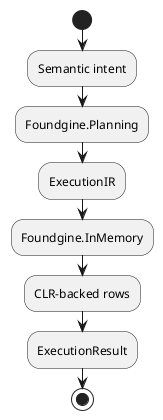
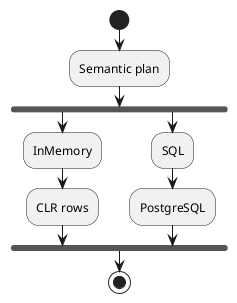
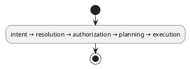

# Foundgine.InMemory

`Foundgine.InMemory` is a small provider implementation used to prove that Foundgine's logical execution model is genuinely provider-independent.

It executes Foundgine plans over CLR-backed rows without SQL or a database engine.

## Purpose

This package is primarily for:

- architecture tests;
- deterministic examples;
- local development;
- provider-independent planner validation;
- fast tests that should not require PostgreSQL.

It is **not** intended to replace a production database provider.

## Architecture

The same logical plan can therefore be sent to SQL or InMemory.

## Main types

### `InMemoryDataSet`

Represents an in-memory set of rows available to the provider.

### `InMemoryRow`

Represents a row of values.

### `InMemoryPlan`

Provider-specific execution representation for the in-memory provider.

### `InMemoryExecutionProvider`

Executes the supported logical subset without generating SQL. It is a thin `IExecutionProvider` wrapper that delegates to an `InMemoryCompiler`.

### `InMemoryCompiler`

The provider's actual compiler and executor. It implements `IProviderPlanCompiler` (lowers `ExecutionIR`/`SemanticPlan` into an `InMemoryPlan`), `ISecurityInvariantProviderCompiler` (declares which security invariants — authorization, field/relationship visibility, parameterized values, plan-cache context isolation — the provider preserves), and `IProviderSecurityConformanceEvaluator` (checks a plan's required invariants against what it actually satisfies before execution is allowed to proceed).

## Supported subset

The provider intentionally focuses on the execution features required to demonstrate the architectural boundary:

- root scans;
- relationship traversal;
- filters;
- ordering;
- pagination;
- projections.

Provider-independent semantics are still established before execution.

The implementation should not be interpreted as a complete in-memory database engine.

## Why having this provider matters

Without a second provider, it is easy for a logical plan to accidentally contain SQL assumptions.

The intended proof is:

If the plan can only be executed by SQL because it contains table names, SQL aliases, or SQL-specific operations, the abstraction boundary has failed.

## Security

The InMemory provider participates in the same execution/security contract as other providers.

It must not bypass authorization merely because its physical representation is simple.

Provider security conformance remains part of the execution boundary.

## What this package does not provide

It does not provide:

- SQL;
- migrations;
- persistence;
- transactions equivalent to a database;
- production-scale query optimization;
- ORM behavior;
- a general-purpose in-memory database.

## Typical use

Use it when a test needs to validate:

without bringing up PostgreSQL.

For PostgreSQL correctness and performance, use `Foundgine.Sql` and the repository's E2E tests.

## Related packages

- `Foundgine.Planning` — logical plan.
- `Foundgine.Execution` — execution contract.
- `Foundgine.Semantics` — semantic model.
- `Foundgine.Sql` — production-oriented SQL provider.

## Target framework

- .NET 9
- MIT licensed
