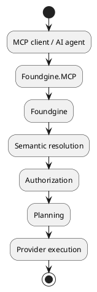
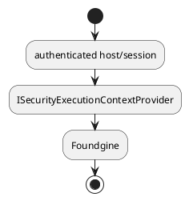
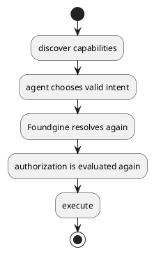
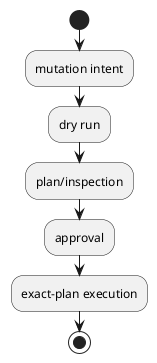
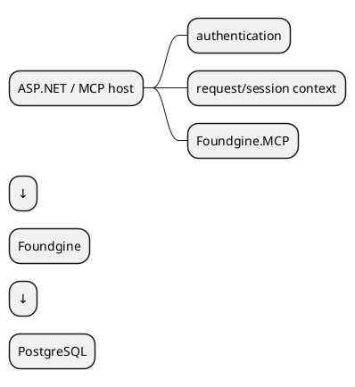

# Foundgine.MCP

`Foundgine.MCP` is the Model Context Protocol adapter for Foundgine's semantic execution boundary.

It exposes Foundgine capabilities and provider-neutral intent as MCP tools while keeping authorization, semantic resolution, planning, and provider execution inside Foundgine.

## Boundary



MCP is a transport adapter. It is not a second execution architecture.

## Exposed read tools

The tool layer includes:

- `foundgine_capabilities` — describes capabilities visible to the authenticated caller;
- `foundgine_query` — submits provider-neutral read intent.

The exact transport/server registration is owned by the host application.

## Hosting

The package can be registered with the official C# MCP SDK.

A typical composition has the shape:

```csharp
builder.Services.AddFoundgine(...);

builder.Services.AddFoundgineMcp(
    securityContextFactory: () => securityContext);

builder.Services
    .AddMcpServer()
    .WithStdioServerTransport()
    .WithTools<FoundgineMcpTools>();
```

`AddFoundgineMcp`'s parameters are all optional and positional order is `contextFactory`, `securityContextProvider`, `securityContextFactory` — pass `securityContextFactory` (or `securityContextProvider`) by name, since passing a security-context lambda positionally would bind to `contextFactory` instead and leave the security context unset.

For HTTP hosting, use the MCP ASP.NET Core transport supplied by the MCP SDK.

The host owns:

- authentication;
- HTTP/session identity;
- tenant selection;
- audience;
- warrant/security context;
- endpoint authorization.

## Security context

MCP arguments must not be treated as an authority source.

Do not allow a tool payload to select:

```text
tenant
identity
audience
authorization role
warrant
database connection
provider
```

Instead:



This prevents an agent from escalating itself by changing ordinary JSON arguments.

## Capability discovery

`FoundgineMcpTools.DescribeCapabilities()` exposes a semantic capability contract suitable for agents.

Discovery is advisory.



Receiving a capability does not create a durable authorization grant.

## Query execution

`ExecuteQueryAsync(...)` accepts structured semantic intent and delegates to the Foundgine runtime.

The MCP layer does not generate SQL.

It also does not bypass semantic validation.

## Safe mutations

`FoundgineMcpMutationTools` can expose a high-assurance mutation workflow when mutation support is configured.

The workflow includes:



The final execution path still uses `IFoundgineMutations`.

Approval is not a substitute for authorization. The execution boundary revalidates the operation and security requirements.

## Hostile-agent boundary

MCP payloads are untrusted.

The package therefore relies on:

- JSON/semantic structural limits;
- host-owned security context;
- semantic resolution;
- authorization;
- provider security conformance;
- mutation approval/security gates where configured.

The model/agent may request an operation. It does not choose how the operation is authorized or physically executed.

## `FoundgineMcpAgentClient`

The client helper can:

- discover capabilities;
- execute queries;
- discover then execute.

It is a convenience client, not an authority broker.

## What this package does not do

It does not:

- implement an LLM;
- authenticate users;
- manage OAuth/JWT;
- define semantic authorization policy;
- generate SQL;
- directly access a database;
- replace an MCP server host.

## Recommended architecture



Keep the application-specific actor/tenant mapping outside the MCP adapter.

## Related packages

- `Foundgine` — runtime facade.
- `Foundgine.Intent.Json` — structured JSON intent.
- `Foundgine.Semantics` — semantic contract/security context.
- `Foundgine.Sql` — SQL provider.

## Target framework

- .NET 9
- ModelContextProtocol SDK
- MIT licensed
