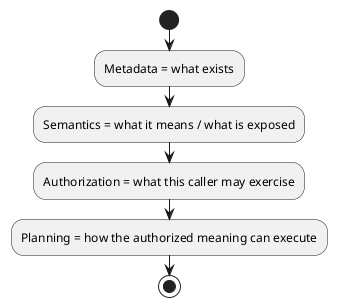
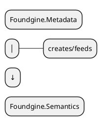
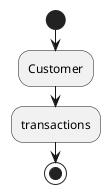
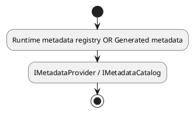
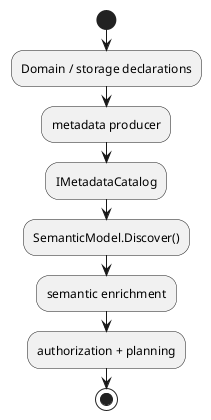

# Foundgine.Metadata

`Foundgine.Metadata` is Foundgine's structural metadata layer.

It describes **what exists** in an application or provider model: entities, fields, identities, relationships, models, connections, conversions, authorization metadata, and storage mappings.

It does not decide what a caller may do and it does not execute a request.

## The boundary

Foundgine deliberately separates structural facts from application meaning:



This prevents database schema details from becoming the semantic API by accident.

## Main types

### `IMetadataCatalog`

The provider-independent catalog contract exposes structural metadata collections and lookup operations.

It can describe:

- entities;
- relationships;
- models;
- connections;
- conversions;
- authorization metadata.

### `MetadataRegistry`

`MetadataRegistry` is the in-memory catalog implementation.

It can register:

```csharp
registry.Register(entityMetadata);
registry.Register(relationshipMetadata);
registry.Register(modelMetadata);
registry.Register(connectionMetadata);
registry.Register(conversionMetadata);
registry.Register(authorizationMetadata);
```

Lookups fail explicitly when a required identity has not been registered.

### Metadata records

The package contains records such as:

- `EntityMetadata`;
- `FieldMetadata`;
- `RelationshipMetadata`;
- `ColumnMetadata`;
- `ModelMetadata`;
- `ConnectionMetadata`;
- `ConnectionFieldMetadata`;
- `ConversionMetadata`;
- `AuthorizationMetadata`;
- `StorageEntityId`;
- `ColumnReference`.

The metadata records carry structural correspondence without requiring the semantic planner to know about the physical database.

## Semantic discovery

`SemanticModelDiscovery` is the bridge from structural metadata into `Foundgine.Semantics`.

```csharp
var semanticModel = metadata.Discover();
```

Or start an enrichable builder:

```csharp
var builder = metadata.FromMetadata();

builder
    .Traversal(
        "Customer",
        "transactions",
        "customerRelationships",
        "contract",
        "transactions");

var model = builder.Build();
```

Discovery creates semantic entities, fields, identities, and direct relationships from the catalog.

It does **not** grant capabilities or authorization.

## Why this package is separate from Semantics

A semantic model may be derived from metadata, but the semantic layer should not depend on every concrete metadata representation.

The dependency is therefore:



The reverse dependency would make application meaning unnecessarily coupled to storage discovery.

## Primary keys

Metadata identifies the physical column that represents an entity's primary key. Semantic discovery maps that structural fact to the corresponding semantic field identity.

If metadata claims a primary key but no effective field maps to it, discovery fails rather than creating an ambiguous semantic model.

## Relationships

`RelationshipMetadata` describes the direct relationship between structural entities, including:

- relationship identity;
- source entity;
- target entity;
- relationship name;
- source key;
- target key;
- collection/reference shape.

This is physical/structural knowledge.

A logical semantic traversal such as:



may be several direct relationships long. Configure that meaning in `Foundgine.Semantics`, not in the structural metadata catalog.

## Mutation schema

`MetadataRegistry` also implements `IMutationSchema`.

This allows the mutation planner/provider boundary to retrieve:

- writable entity columns;
- semantic-field-to-column mappings;
- primary keys;
- relationship key mappings.

That contract is structural. Mutation authorization remains a semantic concern.

## What belongs here

Good candidates:

- schema facts;
- CLR/storage mappings;
- entity/field/relationship identities;
- physical columns;
- direct relationship keys;
- model/entity mappings;
- compile-time discovered metadata.

Poor candidates:

- GraphQL names;
- MCP tool definitions;
- SQL strings;
- authorization decisions for a specific caller;
- business workflows;
- AI prompts.

## AOT

`Foundgine.Aot.Generator` can produce metadata that satisfies the same provider-independent contracts.

That gives applications a choice:



The rest of Foundgine does not need a different semantic architecture for generated metadata.

## Typical flow



## Related packages

- `Foundgine.Abstractions` — stable identities and cross-layer contracts.
- `Foundgine.Semantics` — application meaning and intent.
- `Foundgine.Aot` — declaration attributes.
- `Foundgine.Aot.Generator` — compile-time generation.
- `Foundgine.Sql` — consumes metadata when lowering plans to SQL.

## Target framework

- .NET 9
- MIT licensed
