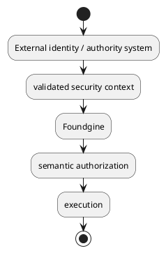
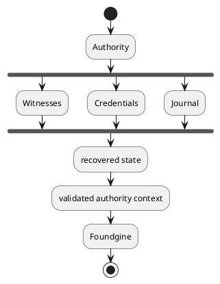
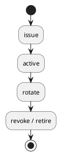
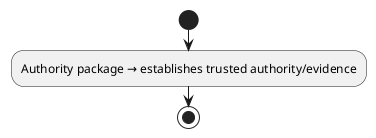
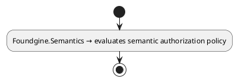
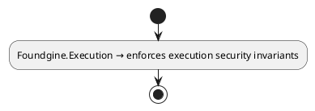

# Foundgine.Security.Authority

`Foundgine.Security.Authority` is optional provider-agnostic infrastructure for managing and recovering an authorization authority/control plane.

It is deliberately **outside Foundgine's core semantic execution boundary**.

## Core distinction

Foundgine core consumes validated security execution context:



This package concerns the system that may produce, publish, recover, reconcile, or rotate that authority.

## Why it is separate

A semantic execution library should not require a distributed authorization control plane.

Applications can use:

```text
Foundgine
  + local/application policy
```

without adopting:

```text
Foundgine.Security.Authority
```

When an application does need high-assurance distributed authority recovery, this package provides the additional primitives without changing the core semantic architecture.

## Responsibilities

The recovery/control-plane implementation covers concerns such as:

- authority state;
- witness quorum;
- authority anchors;
- publication integrity;
- key lifecycle and retirement;
- credential lifecycle;
- credential revocation;
- journal integrity;
- cross-instance reconciliation;
- promotion/failover;
- rejoin/recovery;
- recovery evidence;
- freshness validation;
- audit/reconfiguration records.

## Conceptual model



The exact control-plane topology is application/deployment specific.

## Witness quorum

The package contains abstractions for witness sets and quorum evidence.

The purpose is to avoid treating a single potentially failed/stale authority instance as automatically authoritative during recovery.

## Credential lifecycle

Recovery proposers/witnesses and authority publication can have explicit lifecycle state.

The package models concerns such as:



Credential state is tied to recovery/control-plane evidence rather than being a semantic execution concern.

## Journal integrity

The recovery subsystem maintains explicit journal/reconciliation concepts so recovery can distinguish:

- committed state;
- incomplete state;
- conflicting state;
- stale state;
- repairable state.

The goal is to make recovery decisions evidence-based rather than best-effort.

## Promotion and failover

Promotion is treated as a controlled state transition.

Relevant concepts include:

- authority term;
- promotion state;
- durable commit;
- cross-instance commit;
- reconciliation;
- rejoin safety.

The library is designed around fail-closed validation: insufficient evidence should block a transition rather than silently grant authority.

## Boundary with Foundgine authorization

This package does not replace `ISemanticAuthorizationPolicy`.

The separation is:







## What does not belong here

Do not use this package for:

- GraphQL;
- MCP;
- AI;
- semantic request resolution;
- query planning;
- SQL generation;
- normal provider execution;
- ordinary application business authorization rules.

## When to use it

Use `Foundgine.Security.Authority` when the application has an explicit requirement for durable, recoverable, multi-instance authorization authority.

Do not add it merely because an application uses Foundgine authorization.

## Testing

The repository contains dedicated security-authority tests for adversarial transitions and recovery behavior.

The package is intentionally more specialized than the core semantic packages; applications should adopt it only when its authority/recovery guarantees are required.

## Related packages

- `Foundgine.Semantics` — semantic authorization.
- `Foundgine.Execution` — execution security boundary.
- `Foundgine.Abstractions` — shared contracts.

## Target framework

- .NET 9
- MIT licensed
