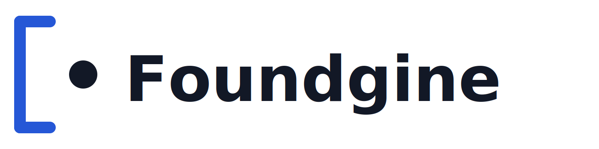

<picture>
  <source media="(prefers-color-scheme: dark)" srcset="docs-site/assets/logo/foundgine-logo-dark.png">
  
</picture>

[](https://www.nuget.org/packages/Foundgine.Core/)
[](https://www.nuget.org/packages?q=Foundgine)
[](https://github.com/CristianBarragan/Foundgine/actions/workflows/build.yml)
[](https://github.com/CristianBarragan/Foundgine/actions/workflows/build.yml)
[](https://github.com/CristianBarragan/Foundgine/actions/workflows/build.yml)
[](https://github.com/CristianBarragan/Foundgine/actions/workflows/build.yml)
[](https://github.com/CristianBarragan/Foundgine/actions/workflows/build.yml)

# Foundgine

**Programmable semantic execution for .NET.**

Foundgine gives application code, APIs, GraphQL, MCP and AI agents one application-controlled boundary between **caller intent**, **application meaning**, **authorization** and **physical execution**.

# The problem

As applications expose more functionality to any caller, you can end up with lots of individual tools/endpoints, each containing its own validation, authorization, query logic, and business rules.

Foundgine tries to centralize that into a semantic execution boundary. The caller says what it wants, while the application remains responsible for deciding what is allowed and how it gets executed.

A complex application may have several ways to express an operation:

```text
Application code
GraphQL
JSON
AI-generated intent
```

Without a common semantic execution layer, each surface tends to grow its own rules for:

- what entities and fields exist;
- which relationships can be traversed;
- which filters are valid;
- what the caller is authorized to access; and
- how the request becomes database or service operations.

That produces duplicated semantics and inconsistent security boundaries.

# Why Foundgine

Foundgine exists to provide a stable execution boundary between **application intent** and **physical execution**.

The problem is not that applications lack APIs. The problem is that every new intent source can otherwise become responsible for understanding the application's model, relationships, authorization rules, and provider-specific execution details.

Foundgine centralizes that responsibility.

[**Go to website →**](https://cristianbarragan.github.io/Foundgine/docs-site/)

## The idea

```text
Caller → Intent → Semantic Model → Operation Graph
       → Resolution → Authorization → Plan Binding
       → ExecutionIR → Provider → Result + Evidence
```

Retrieval can discover candidates and evidence, but **retrieval is not authorization**. The application owns identity and policy; providers execute the already-authorized artifact.

<p align="center"></p>

## Get started

The fastest path is the Supply Chain sample pair:

- **Starter:** [`samples/Foundgine.SupplyChain`](samples/Foundgine.SupplyChain) — the smallest realistic application boundary.
  - [Build it step by step](samples/Foundgine.SupplyChain/SupplyChain-Starter-Tutorial.md)
  - [Understand why it is structured this way](samples/Foundgine.SupplyChain/Foundgine-SupplyChain-Explained.md)
- **Advanced:** [`samples/Foundgine.SupplyChain.Advanced`](samples/Foundgine.SupplyChain.Advanced) — richer semantics, grounding, retrieval, authorization and adversarial testing.
  - Start at [`docs/00-Overview-And-Setup.md`](samples/Foundgine.SupplyChain.Advanced/docs/00-Overview-And-Setup.md) and follow 01–05.

For the conceptual path, use [`docs/README.md`](docs/README.md) or the [documentation site](https://cristianbarragan.github.io/Foundgine/docs-site/).

## Walkthrough

**[From Natural Language to Authorized Execution](https://cristianbarragan.github.io/Foundgine/docs-site/walkthrough/)** traces one request — “show me overdue purchase orders from our top supplier in Texas” — through every layer with representative payloads.

## Why the boundary matters

The number of independent execution surfaces is a security and maintenance multiplier. A tool-per-capability design can give an agent dozens of places where authorization, tenant filtering and query construction are implemented differently. Foundgine centralizes the semantic decision without making a transport or database the center of the architecture.

For the deeper rationale, read:

- [`docs/WHY-FOUNDGINE.md`](docs/WHY-FOUNDGINE.md)
- [`docs/APPLICATION-CATEGORIES.md`](docs/APPLICATION-CATEGORIES.md)
- [`docs/ARCHITECTURE.md`](docs/ARCHITECTURE.md)
- [`docs/AUTHORIZATION.md`](docs/AUTHORIZATION.md)
- [`docs/SECURITY.md`](docs/SECURITY.md)
- [`docs/AI-AGENT.md`](docs/AI-AGENT.md)

## Package shape

The current source layout is consolidated into four publishable packages:

| Package | Responsibility |
|---|---|
| `Foundgine.Core` | Semantic model, metadata, intent, planning and provider-independent contracts |
| `Foundgine.Runtime` | Application-facing orchestration, authorization and execution |
| `Foundgine.Providers` | Storage, AI/model, MCP, AOT and other concrete integrations |
| `Foundgine.Extensions` | Optional framework integrations such as Hot Chocolate GraphQL |

The normal application starting point is `Foundgine.Runtime` + `Foundgine.Providers`. See the [package guide](docs-site/packages/) for the current boundary map.

## Evidence

The repository contains controlled benchmarks and deterministic security tests. The public evidence distinguishes **measured** tool calls, latency, RPS and success/failure counts from **estimated** context metrics.

- [Agent benchmark explorer](https://cristianbarragan.github.io/Foundgine/docs-site/agent-benchmark/)
- [Supply Chain E2E](https://cristianbarragan.github.io/Foundgine/docs-site/agent-benchmark/supply-chain/)
- [Security PenTest](https://cristianbarragan.github.io/Foundgine/docs-site/samples/pentest/)
- [`benchmarks/AgentEndToEnd/README.md`](benchmarks/AgentEndToEnd/README.md)

Benchmark results are workload-specific and should not be generalized beyond the published experiment.

## Development

```bash
dotnet restore
dotnet build
dotnet test
```

PostgreSQL integration testing: [`docs/POSTGRES-E2E.md`](docs/POSTGRES-E2E.md).

Current release: **2.0.0** · **.NET 9**

Foundgine is licensed under the MIT license.
