# ☕ GraphQL Coffee Beanery

> An AST-driven GraphQL execution engine for .NET that generates optimized queries, mutations, upserts, and graph relationship execution plans.

[](https://dotnet.microsoft.com/)
[](https://chillicream.com/)
[](https://www.postgresql.org/)

---

## What is Coffee Beanery?

GraphQL Coffee Beanery is a high-performance GraphQL execution engine designed for modern .NET applications.

Instead of resolving every field independently, Coffee Beanery analyzes the complete GraphQL Abstract Syntax Tree (AST) and creates an optimized execution strategy.

Coffee Beanery supports:

- ✅ GraphQL query execution
- ✅ GraphQL mutation execution
- ✅ Generated SQL operations
- ✅ Generated INSERT operations
- ✅ Generated UPDATE operations
- ✅ Generated UPSERT operations
- ✅ Recursive graph traversal using SQL CTEs
- ✅ Native graph traversal using Apache AGE and Cypher
- ✅ Source-generated metadata
- ✅ Native AOT-friendly execution
- ✅ CQRS-compatible architectures

---

## The Core Idea

The GraphQL request already contains the execution intent:

- Requested fields
- Entity relationships
- Mutation inputs
- Response shape
- Traversal requirements

Coffee Beanery uses this information to generate the most efficient execution path.

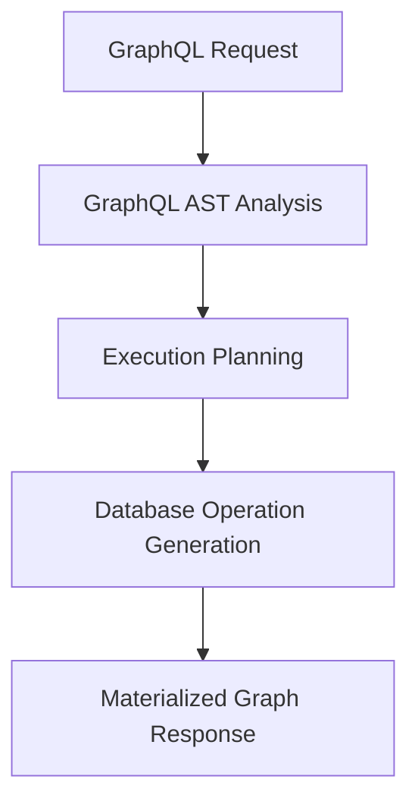

---

# Why Coffee Beanery?

Traditional GraphQL execution commonly follows a resolver-per-field approach.

Example:

```text
GraphQL Field

        |

        v

Resolver

        |

        v

Database Call

        |

        v

Field Result
```

This works well for simple APIs but can introduce:

- Resolver complexity
- N+1 query problems
- Manual relationship loading
- Repeated projection logic

Coffee Beanery uses operation-level execution.

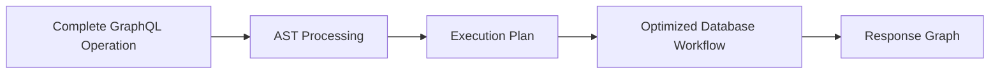

---

# Architecture Overview

Coffee Beanery consists of four main execution layers:

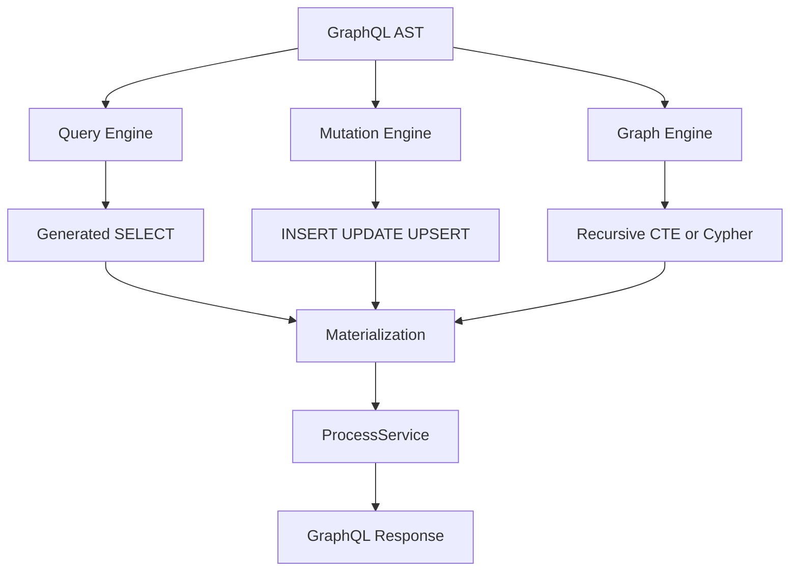

---

## Query Engine

The Query Engine handles:

- GraphQL selection analysis
- Relationship discovery
- SQL generation
- Projection optimization
- Strongly typed materialization

---

## Mutation Engine

The Mutation Engine handles:

- Mutation AST processing
- Input mapping
- Write operation generation
- Database execution
- Response projection

Supported operations:

- Insert
- Update
- Upsert

---
---

# Mutation Execution

Coffee Beanery treats mutations as a first-class execution capability.

A GraphQL mutation contains two separate responsibilities:

1. **State modification**
2. **Response projection**

Coffee Beanery separates these concerns.

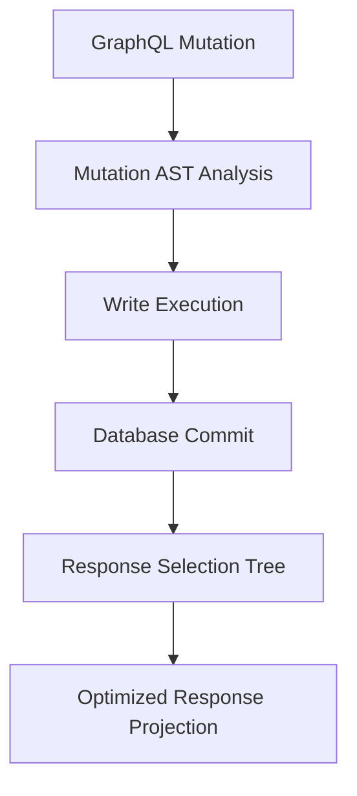

This allows applications to use:

- Generated mutations
- Custom business commands
- CQRS handlers
- Hybrid write workflows

without losing optimized response execution.

---

# Generated Mutation Operations

Coffee Beanery can generate database write operations directly from the GraphQL mutation AST.

Supported operations:

| Operation | Support |
|---|---|
| INSERT | ✅ |
| UPDATE | ✅ |
| UPSERT | ✅ |

---

# Generated INSERT

Example GraphQL mutation:

```graphql
mutation {
  createProduct(
    input: {
      name: "Ethiopian Coffee"
      price: 18.99
    }
  ) {
    id
    name
  }
}
```

Coffee Beanery can translate the mutation input into an optimized database insert operation.

Execution:

```text
GraphQL Mutation

        |

        v

Mutation AST

        |

        v

Generated INSERT

        |

        v

Database Execution

        |

        v

GraphQL Response
```

---

# Generated UPDATE

Example:

```graphql
mutation {
  updateProduct(
    input: {
      id: 10
      price: 22.99
    }
  ) {
    id
    price
  }
}
```

The mutation pipeline understands:

- Entity identity
- Changed fields
- Required response fields

and generates the appropriate update workflow.

---

# Generated UPSERT

Coffee Beanery supports generating UPSERT operations directly from the GraphQL AST.

UPSERT combines:

- Insert behavior
- Update behavior
- Conflict resolution

Common use cases:

- Data synchronization
- Inventory management
- External system imports
- Configuration management
- Administrative APIs

Example:

```graphql
mutation {
  upsertProduct(
    input: {
      id: 42
      name: "Colombian Coffee"
      stock: 100
    }
  ) {
    id
    name
    stock
  }
}
```

Execution:

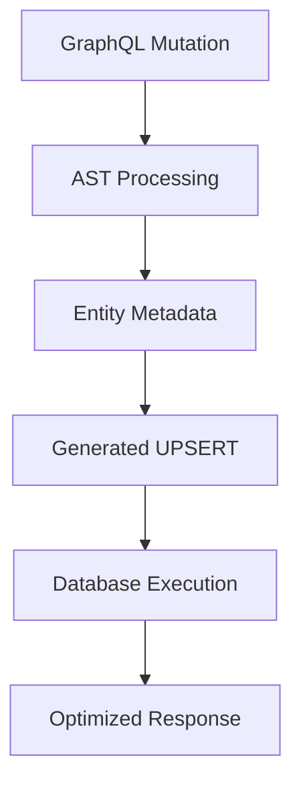

---

# Mutation Response Optimization

A common GraphQL challenge is the mutation response.

Example:

```graphql
mutation {
  adjustInventory(
    productId: 42
    amount: -5
  ) {
    product {
      name
      stock
      supplier {
        name
        address {
          city
        }
      }
    }
  }
}
```

After the write operation completes, Coffee Beanery can analyze the response selection tree and optimize the returned graph.

The mutation does not need to manually load:

- Related entities
- Nested objects
- Additional projections

The response pipeline remains optimized.

---

# Hybrid Mutation Architecture

Coffee Beanery supports multiple mutation strategies.

## Option 1: Fully Generated Mutation

```text
GraphQL Mutation

        |

        v

Coffee Beanery Mutation Engine

        |

        v

Generated SQL

        |

        v

Database
```

---

## Option 2: Custom Business Mutation

```text
GraphQL Mutation

        |

        v

Application Command

        |

        v

Business Logic

        |

        v

Database Update
```

---

## Option 3: Hybrid Mutation

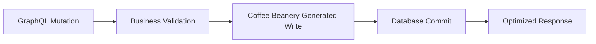

This allows enterprise applications to combine:

- Domain logic
- Transactions
- Messaging
- Generated database operations
- Optimized GraphQL responses

---
---

# Graph Relationship Execution

Modern applications often contain graph-shaped data:

- Organization hierarchies
- Product categories
- Dependency networks
- Knowledge graphs
- Recommendation systems
- Entity relationships

Coffee Beanery understands GraphQL relationships as graph traversal requirements.

The execution engine can choose between:

1. Relational graph execution using recursive SQL
2. Native graph execution using Apache AGE and Cypher

---

# Relational Graph Execution

For relational databases, Coffee Beanery can execute graph relationships using recursive Common Table Expressions (CTEs).

This approach works well for:

- Parent/child structures
- Hierarchies
- Trees
- Organizational structures
- Recursive relationships

Example:

```graphql
query {
  organization {
    name
    children {
      name
      children {
        name
      }
    }
  }
}
```

Execution:

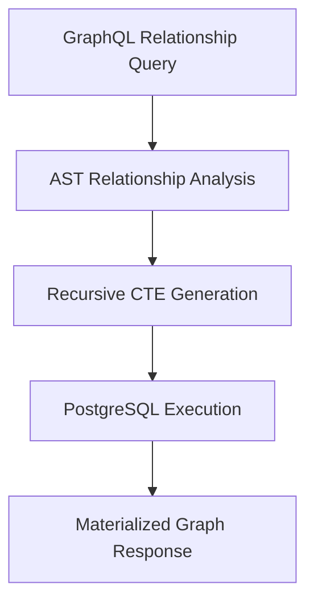

---

# Recursive CTE Advantages

Using recursive SQL allows Coffee Beanery to support:

- Hierarchical traversal
- Unlimited relationship depth
- Parent-child exploration
- Recursive reporting
- Graph-shaped relational models

Example scenarios:

## Organization Trees

```text
Company

 ├── Department

 │       ├── Team

 │       └── Employee

 └── Department
```

---

## Category Trees

```text
Products

 ├── Coffee

 │      ├── Espresso

 │      └── Filter

 └── Equipment
```

---

# Native Graph Execution with Apache AGE

For graph-native workloads, Coffee Beanery can integrate with Apache AGE.

Apache AGE extends PostgreSQL with graph database capabilities and supports Cypher queries.

This enables scenarios where graph traversal is the primary execution model.

---

# Apache AGE Architecture

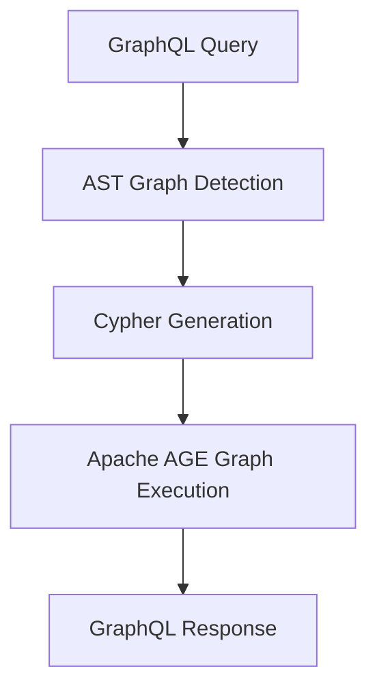

---

# Apache AGE Use Cases

Native graph execution is useful for:

- Knowledge graphs
- Recommendation engines
- Relationship analysis
- Fraud detection
- Network analysis
- Complex entity traversal

Example relationship:

```text
Customer

   |

   purchased

   |

Product

   |

   supplied_by

   |

Supplier
```

---

# Unified GraphQL Graph Model

The same GraphQL schema can represent relationships regardless of storage strategy.

Coffee Beanery can support:

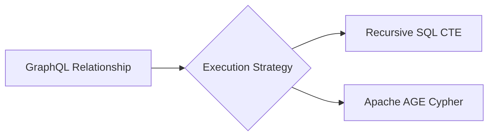

---

# Graph Execution Philosophy

Coffee Beanery does not force every relationship into one storage model.

Instead:

- Relational databases can execute recursive graphs.
- Graph databases can execute native traversals.
- GraphQL remains the API contract.

The GraphQL AST describes the intent.

Coffee Beanery selects the execution strategy.

---

# Supported Graph Scenarios

| Scenario | Execution Strategy |
|---|---|
| Organization hierarchy | Recursive CTE |
| Category tree | Recursive CTE |
| Product relationships | SQL or Graph |
| Knowledge graph | Apache AGE |
| Recommendation graph | Apache AGE |
| Complex traversal | Cypher |

---
---

# Source Generator Architecture

Coffee Beanery uses C# Source Generators to move execution intelligence from runtime into compile time.

Instead of discovering mappings repeatedly during execution, Coffee Beanery generates the metadata required for optimized execution during application compilation.

Generated information can include:

- Entity mappings
- Relationship mappings
- Navigation paths
- Materialization rules
- Database execution metadata

---

# Compile-Time Execution Model

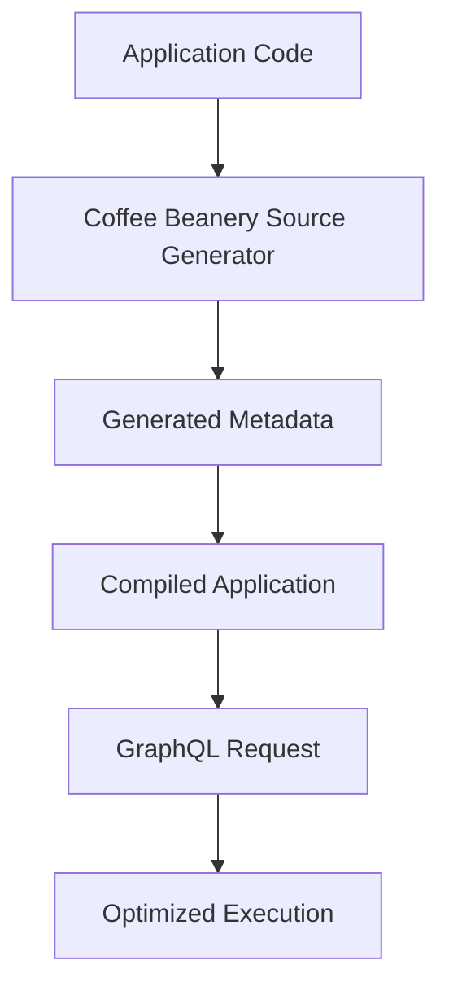

---

# Benefits of Source Generation

## Performance

Compile-time generation reduces runtime work.

Benefits:

- Faster startup
- Reduced metadata discovery
- Predictable execution paths

---

## Strong Typing

Generated mappings use C# types.

Benefits:

- Compile-time validation
- Refactoring support
- Better developer experience

---

## Native AOT-Friendly Design

Coffee Beanery is designed with Native AOT scenarios in mind.

The architecture minimizes:

- Runtime reflection
- Dynamic proxy generation
- Runtime code generation
- Runtime mapping discovery

Instead, Coffee Beanery relies on:

- Generated code
- Strongly typed metadata
- Compile-time analysis

---

# Execution Model

The complete pipeline:

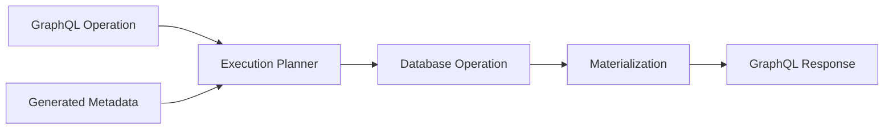

---

# Relationship Mapping

Coffee Beanery source generation understands relationships between entities.

Examples:

```text
Customer

    |

    v

Orders

    |

    v

Order Items

    |

    v

Products
```

Generated metadata allows the runtime engine to understand:

- Relationship direction
- Navigation paths
- Join requirements
- Recursive traversal opportunities

---

# Database Abstraction

Coffee Beanery focuses on GraphQL execution rather than replacing database libraries.

It can work with:

- Dapper
- EF Core
- PostgreSQL
- Custom SQL execution strategies

The framework provides:

```text
GraphQL Intent

        |

        v

Execution Plan

        |

        v

Database Strategy
```

---

# EF Core Compatibility

Coffee Beanery and EF Core solve different problems.

EF Core provides:

- Entity tracking
- Migrations
- Change management
- Domain persistence

Coffee Beanery provides:

- GraphQL AST processing
- Query generation
- Mutation generation
- Upsert generation
- Response optimization

They can be combined.

Example:

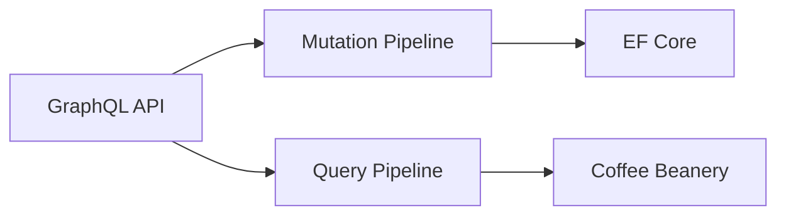

---

# Dapper Compatibility

Coffee Beanery works naturally with lightweight database access approaches.

Dapper provides:

- Fast execution
- Minimal abstraction
- Direct SQL mapping

Coffee Beanery provides:

- GraphQL understanding
- SQL generation
- Relationship planning
- Materialization strategy

Together:

```text
GraphQL Request

        |

        v

Coffee Beanery

        |

        v

Generated SQL

        |

        v

Dapper Execution
```

---
---

# ProcessService Architecture

Coffee Beanery provides an enterprise extension point called `ProcessService`.

`ProcessService` operates between:

1. Database materialization
2. GraphQL response generation

This creates a controlled location where applications can apply business rules without modifying generated execution code.

---

# ProcessService Pipeline

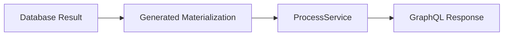

---

# Why ProcessService Exists

Automated execution engines are excellent at predictable operations:

- Query generation
- Relationship loading
- Object materialization

Enterprise applications also require custom behavior:

- Business calculations
- Security policies
- Data transformations
- Caching
- Auditing

ProcessService provides this customization layer.

---

# Business Logic Injection

Some calculations should happen after data retrieval.

Examples:

- Dynamic pricing
- Customer-specific calculations
- Runtime scoring
- External service enrichment
- Feature evaluation

Example:

```csharp
public Product Process(Product product)
{
    product.FinalPrice =
        pricingService.Calculate(product);

    return product;
}
```

The generated database operation remains optimized while business rules remain in application code.

---

# Data Transformation

ProcessService can transform materialized objects before returning them.

Examples:

- Formatting values
- Adding calculated fields
- Normalizing responses
- Applying presentation rules

Example:

```csharp
public Customer Process(Customer customer)
{
    customer.DisplayName =
        $"{customer.FirstName} {customer.LastName}";

    return customer;
}
```

---

# Security and Data Protection

Security requirements often depend on runtime context.

Examples:

- JWT claims
- User permissions
- Tenant context
- Data classification rules

ProcessService can apply:

- Field masking
- Data filtering
- PII protection
- Authorization-based transformations

Example:

```csharp
if (!authorization.CanViewEmail)
{
    customer.Email = null;
}
```

---

# Multi-Tenant Processing

Coffee Beanery supports tenant-aware execution strategies.

Tenant information can come from:

- Authentication claims
- Request context
- Application services
- Custom policies

Architecture:

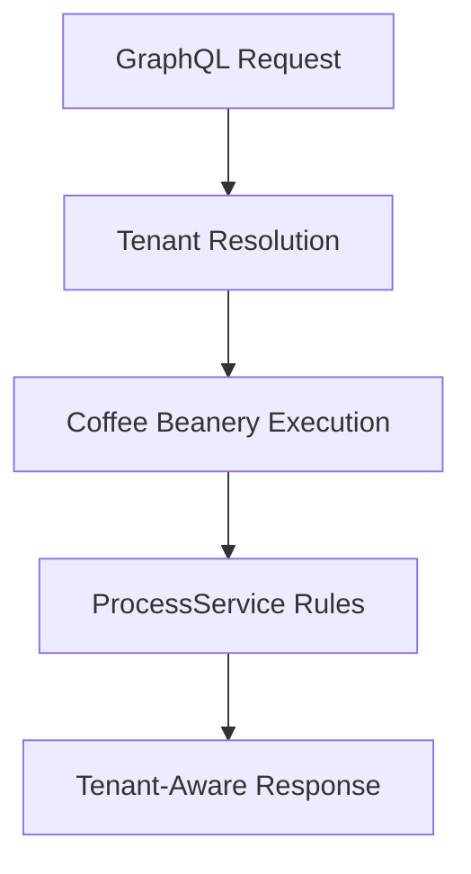

---

# Caching Architecture

ProcessService can provide a location for payload-level caching.

Possible cache layers:

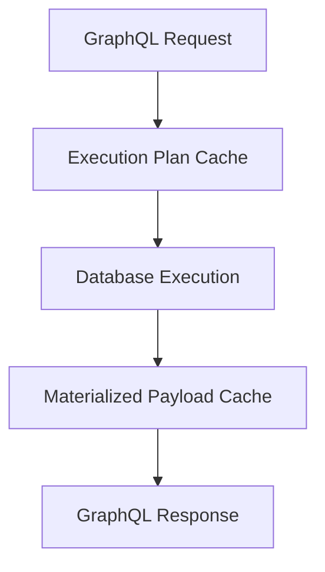

---

# Cache Scenarios

Supported strategies include:

- Memory cache
- Distributed cache
- Redis-backed cache
- Custom cache providers

Example:

```text
Request

   |

   v

Cache Lookup

   |

   +------------+

   |            |

  Hit         Miss

   |            |

   v            v

Return      Execute Query

                |

                v

          Store Result
```

---

# Auditing Support

Enterprise systems often require audit trails.

ProcessService and mutation workflows can support:

- Change tracking
- User identification
- Tenant auditing
- Event generation

Example:

```text
Mutation

    |

    v

Write Execution

    |

    v

Audit Event

    |

    v

Audit Store
```

---

# Enterprise Extension Philosophy

Coffee Beanery separates:

## Generated Execution

Responsible for:

- AST processing
- SQL generation
- Relationship traversal
- Materialization

## Application Extensions

Responsible for:

- Business rules
- Security
- Caching
- Domain policies

This allows customization without sacrificing performance.

---
---

# CQRS Architecture Support

Coffee Beanery naturally fits Command Query Responsibility Segregation (CQRS) architectures.

The framework separates:

- Read execution
- Write execution
- Response projection

This allows applications to choose the right strategy for each workload.

---

# Query Side

The query side focuses on optimized data retrieval.

Coffee Beanery provides:

- GraphQL AST analysis
- Relationship planning
- Generated queries
- Projection optimization
- Graph traversal support

Architecture:

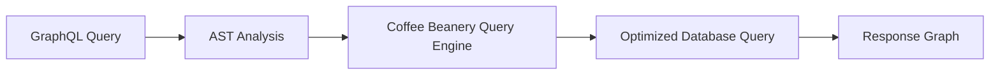

---

# Command Side

The command side focuses on state changes.

Applications can choose:

- Generated mutations
- Domain commands
- Application services
- EF Core workflows
- Dapper workflows
- Event-driven commands

Architecture:

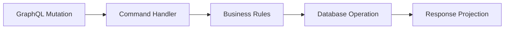

---

# Hybrid CQRS Model

Coffee Beanery supports combining generated execution with domain-driven workflows.

Example:

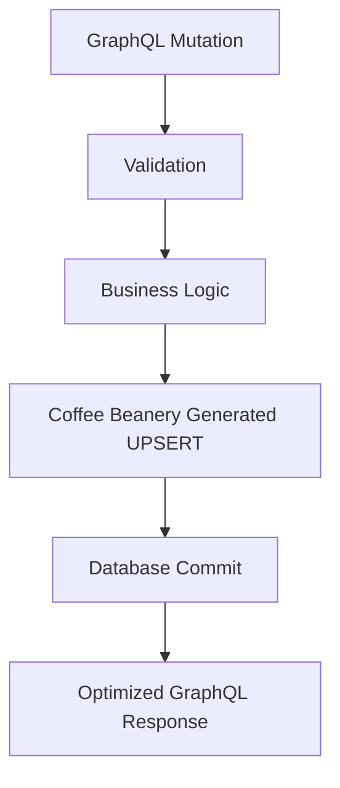

---

# Enterprise Mutation Patterns

Coffee Beanery supports different levels of automation.

---

## Fully Generated Mutation

Best for:

- CRUD APIs
- Administrative systems
- Data management platforms

Flow:

```text
GraphQL Mutation

        |

        v

Mutation AST

        |

        v

Generated SQL

        |

        v

Database
```

---

## Domain-Driven Mutation

Best for:

- Complex business workflows
- Financial systems
- Enterprise processes

Flow:

```text
GraphQL Mutation

        |

        v

Domain Command

        |

        v

Business Rules

        |

        v

Persistence Layer
```

---

## Hybrid Mutation

Best for:

- Enterprise applications requiring both flexibility and performance

Flow:

```text
GraphQL Mutation

        |

        v

Business Validation

        |

        v

Generated Database Operation

        |

        v

Optimized Response
```

---

# Distributed Database Support

Coffee Beanery is designed for architectures that require scalability.

Supported scenarios include:

- Large PostgreSQL deployments
- Distributed PostgreSQL
- Citus-based architectures
- Read/write separation
- Specialized graph workloads

---

# PostgreSQL and Citus Architecture

Coffee Beanery can support PostgreSQL environments where data is distributed across nodes.

Example:

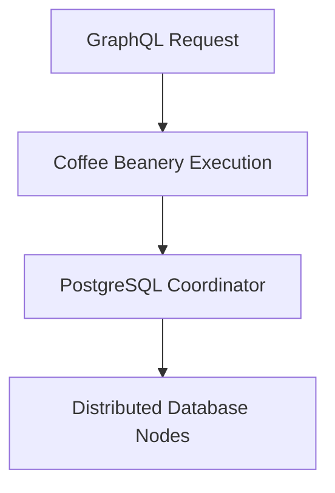

---

# Graph and Relational Hybrid Architecture

Applications can combine:

## Relational Data

Examples:

- Customers
- Orders
- Inventory
- Transactions

Using:

- SQL
- Recursive CTEs

## Graph Data

Examples:

- Relationships
- Networks
- Knowledge graphs

Using:

- Apache AGE
- Cypher

Architecture:

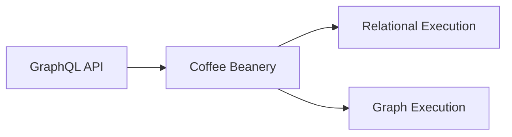

---

# Enterprise Design Goal

Coffee Beanery is designed to provide:

- GraphQL flexibility
- Database performance
- Compile-time optimization
- Enterprise customization
- Multiple storage strategies

without forcing applications into a single architectural pattern.

---
---

# Feature Overview

Coffee Beanery combines GraphQL flexibility with optimized execution.

| Capability | Supported |
|---|---|
| GraphQL AST processing | ✅ |
| Query generation | ✅ |
| Mutation generation | ✅ |
| INSERT generation | ✅ |
| UPDATE generation | ✅ |
| UPSERT generation | ✅ |
| Relationship traversal | ✅ |
| Recursive SQL CTE execution | ✅ |
| Apache AGE graph execution | ✅ |
| Cypher graph queries | ✅ |
| Source Generators | ✅ |
| Native AOT-friendly design | ✅ |
| ProcessService extensions | ✅ |
| CQRS architectures | ✅ |
| Dapper integration | ✅ |
| EF Core integration | ✅ |

---

# Supported Execution Strategies

Coffee Beanery can optimize different workloads using different strategies.

| Workload | Strategy |
|---|---|
| Standard entity queries | Generated SQL |
| Deep relationships | Optimized projections |
| Hierarchical data | Recursive CTE |
| Graph traversal | Apache AGE / Cypher |
| CRUD mutations | Generated mutations |
| Synchronization workflows | Generated UPSERT |
| Complex business workflows | Custom commands |

---

# Installation

Install the Coffee Beanery package:

```bash
dotnet add package GraphQL.Coffee.Beanery
```

Restore dependencies:

```bash
dotnet restore
```

Build:

```bash
dotnet build
```

---

# Basic Configuration

Register Coffee Beanery with your GraphQL server.

Example:

```csharp
builder.Services
    .AddGraphQLServer()
    .AddCoffeeBeanery();
```

---

# Example Query

GraphQL:

```graphql
query {
  customers {
    id
    name
    orders {
      id
      total
      items {
        product {
          name
        }
      }
    }
  }
}
```

Coffee Beanery analyzes the complete selection tree and generates the optimized execution plan.

---

# Example Mutation

GraphQL:

```graphql
mutation {
  updateInventory(
    input: {
      productId: 42
      amount: -5
    }
  ) {
    product {
      id
      name
      stock
    }
  }
}
```

Execution:

```text
Mutation AST

      |

      v

Write Operation

      |

      v

Database Update

      |

      v

Optimized Response Projection
```

---

# Example UPSERT

GraphQL:

```graphql
mutation {
  upsertProduct(
    input: {
      id: 100
      name: "Dark Roast"
      inventory: 250
    }
  ) {
    id
    name
    inventory
  }
}
```

Coffee Beanery generates the appropriate database upsert workflow based on:

- Entity metadata
- Mutation input
- Database capabilities

---

# Example Graph Traversal

GraphQL:

```graphql
query {
  category {
    name
    children {
      name
      children {
        name
      }
    }
  }
}
```

Execution options:

```text
Option 1:

GraphQL AST

      |

      v

Recursive SQL CTE


Option 2:

GraphQL AST

      |

      v

Cypher Query

      |

      v

Apache AGE
```

---

# Quick Start Philosophy

Coffee Beanery follows one principle:

> The developer describes the data requirement. The execution engine determines the optimized database workflow.

---
---

# Performance Philosophy

Coffee Beanery focuses on reducing unnecessary runtime decisions.

The framework moves optimization decisions into:

- GraphQL AST analysis
- Source generation
- Execution planning
- Generated database operations

---

# Traditional Execution Model

Many GraphQL systems execute requests incrementally.

```text
Request

   |

   v

Resolver

   |

   v

Database Query

   |

   v

Resolver

   |

   v

Database Query
```

Potential challenges:

- Repeated database access
- Manual batching
- Relationship management
- Projection duplication

---

# Coffee Beanery Execution Model

Coffee Beanery analyzes the complete operation.

```mermaid
flowchart TD

A[GraphQL Request]

B[AST Analysis]

C[Execution Strategy]

D[Generated Database Operations]

E[Materialized Object Graph]

F[GraphQL Response]


A --> B
B --> C
C --> D
D --> E
E --> F
```

---

# Optimization Areas

Coffee Beanery optimizes:

## Query Execution

- Field selection
- Relationship loading
- Projection generation
- Recursive traversal

---

## Mutation Execution

- Input mapping
- INSERT generation
- UPDATE generation
- UPSERT generation
- Response projection

---

## Graph Execution

- Recursive relational traversal
- Graph-native traversal
- Relationship optimization

---

# Architecture Comparison

Coffee Beanery is designed for scenarios where GraphQL flexibility and database performance are both required.

| Capability | Coffee Beanery | Resolver Model | DataLoader | ORM Projection |
|---|---|---|---|---|
| Full AST analysis | ✅ | Partial | ❌ | Partial |
| Query generation | ✅ | ❌ | ❌ | Partial |
| Mutation generation | ✅ | Manual | ❌ | Partial |
| UPSERT generation | ✅ | Manual | ❌ | Partial |
| Recursive graph support | ✅ | Manual | ❌ | Partial |
| Apache AGE support | ✅ | Manual | ❌ | ❌ |
| Source generation | ✅ | ❌ | ❌ | Partial |
| Native AOT focus | ✅ | Partial | Partial | Partial |

---

# Why AST-Driven Execution Matters

GraphQL already provides the execution contract.

The AST contains:

- Requested data shape
- Relationship requirements
- Mutation intent
- Response requirements

Coffee Beanery uses that information instead of requiring developers to manually describe every database operation.

---

# Design Principles

Coffee Beanery follows these principles:

## 1. GraphQL Defines Intent

The schema and operation describe what the client needs.

---

## 2. The Execution Engine Chooses Strategy

The framework determines:

- SQL execution
- Recursive traversal
- Graph traversal
- Mutation workflow

---

## 3. Business Logic Remains Flexible

Applications can still use:

- Domain-driven design
- CQRS
- Custom commands
- External services
- Enterprise policies

---

## 4. Generated Code Should Be Predictable

Source generation provides:

- Strong typing
- Compile-time validation
- Runtime efficiency

---

# Target Applications

Coffee Beanery is designed for:

- Enterprise APIs
- SaaS platforms
- Data-heavy applications
- Inventory systems
- Knowledge graphs
- Reporting platforms
- Internal business systems

---
---

# Project Structure

Coffee Beanery is organized around the following concepts:

```text
GraphQL Coffee Beanery

│
├── AST Processing
│
├── Source Generation
│
├── Query Execution
│
├── Mutation Execution
│
├── Graph Relationship Execution
│
├── Materialization
│
└── Enterprise Extensions
```

---

# Execution Components

## AST Processing

Responsible for understanding:

- GraphQL operations
- Field selections
- Arguments
- Relationships
- Mutation inputs

---

## Query Engine

Responsible for:

- Read operations
- Projection generation
- Relationship traversal
- SQL execution planning

---

## Mutation Engine

Responsible for:

- Write operations
- Generated inserts
- Generated updates
- Generated upserts

---

## Graph Engine

Responsible for:

- Recursive SQL traversal
- Graph relationship execution
- Apache AGE integration scenarios
- Cypher-based traversal

---

## Materialization Engine

Responsible for:

- Database result processing
- Entity graph creation
- Response preparation

---

## Extension Pipeline

Responsible for:

- Business logic
- Security
- Caching
- Transformations
- Auditing

---

# Roadmap

Coffee Beanery continues evolving toward a complete GraphQL execution platform.

Future areas include:

- Additional database providers
- More execution optimizations
- Expanded graph capabilities
- Distributed execution improvements
- Advanced caching strategies
- More source generator capabilities

---

# Contributing

Contributions are welcome.

Areas where contributions are valuable:

- Performance improvements
- Database integrations
- Graph execution scenarios
- Source generator improvements
- Documentation
- Testing
- Examples

---

# Development Setup

Clone the repository:

```bash
git clone https://github.com/CristianBarragan/GraphQL-Coffee-Beanery.git
```

Navigate to the project:

```bash
cd GraphQL-Coffee-Beanery
```

Restore dependencies:

```bash
dotnet restore
```

Build:

```bash
dotnet build
```

Run tests:

```bash
dotnet test
```

---

# Reporting Issues

When opening an issue, include:

- .NET version
- Database provider
- GraphQL operation
- Expected behavior
- Actual behavior
- Minimal reproduction example

---

# Documentation Files

Additional documentation:

- `README.md`  
  Main developer documentation.

- `ai.seo.md`  
  Search and AI discovery metadata.

- `llms.txt`  
  Machine-readable project context.

---
---

# Final Architecture Summary

Coffee Beanery combines several execution concepts into a single GraphQL platform:

```mermaid
flowchart TB

A[GraphQL API]

B[AST Execution Engine]

C[Source Generated Metadata]

D[Query Engine]

E[Mutation Engine]

F[Graph Engine]

G[ProcessService]

H[Database Layer]


A --> B

C --> B

B --> D
B --> E
B --> F

D --> G
E --> G
F --> G

G --> H
```

---

# What Makes Coffee Beanery Different?

Coffee Beanery is designed around the idea that GraphQL is already a complete execution description.

The GraphQL AST already contains:

- Requested fields
- Entity relationships
- Mutation intent
- Response requirements
- Traversal depth

Instead of manually translating every resolver into database operations, Coffee Beanery builds an execution plan from the operation itself.

---

# Supported Architecture Patterns

Coffee Beanery supports:

## API Patterns

- GraphQL APIs
- Enterprise APIs
- Data platforms
- Internal applications

---

## Application Patterns

- CQRS
- Domain-driven design
- Hybrid architectures
- Service-oriented systems

---

## Database Patterns

- Relational databases
- PostgreSQL
- Recursive graph traversal
- Graph databases through Apache AGE
- Distributed PostgreSQL architectures

---

# The Coffee Beanery Vision

The goal is to provide a GraphQL execution architecture that delivers:

☕ GraphQL flexibility

+

⚡ Optimized database execution

+

🧬 Graph relationship intelligence

+

🔧 Enterprise customization

+

🚀 Compile-time optimization

---

# License

This project is licensed under the terms included in the repository license file.

---

# Closing Statement

Coffee Beanery is a GraphQL execution engine built for applications where:

- Data relationships are complex
- Performance matters
- Mutations need flexibility
- Graph traversal is required
- Enterprise customization is necessary

It provides a bridge between the expressive nature of GraphQL and efficient database execution.
---

## Contributing

Contributions, feedback, and collaboration are welcome.

### Ways to Contribute

- Feature requests
- Bug reports
- Performance improvements
- Documentation enhancements
- Architecture proposals
- New mapping strategies
- Testing improvements

Whether you're improving documentation or proposing major architectural changes, every contribution helps improve the project.

---

## Support

If Coffee Beanery helps your team build faster and more scalable GraphQL APIs, consider supporting the project.

[Buy me a Coffee ☕] *I would love a 100% colombian coffee!*

[](https://www.buymeacoffee.com/cristianbarragan)

---

## Keywords

GraphQL SQL Generator • GraphQL Query Planner • GraphQL Dapper • GraphQL PostgreSQL • GraphQL Database First • GraphQL Runtime SQL • GraphQL Query Optimization • GraphQL Performance • 
