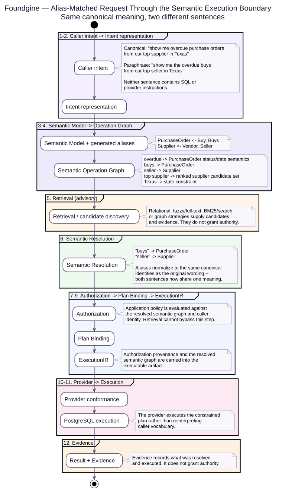
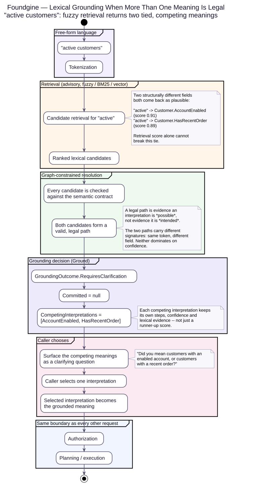

<picture>
  <source media="(prefers-color-scheme: dark)" srcset="docs-site/assets/logo/foundgine-logo-dark.png">
  
</picture>

[](https://www.nuget.org/packages/Foundgine.Core/)
[](https://www.nuget.org/packages?q=Foundgine)
[](https://github.com/CristianBarragan/Foundgine/actions/workflows/build.yml)
[](https://github.com/CristianBarragan/Foundgine/actions/workflows/build.yml)
[](https://github.com/CristianBarragan/Foundgine/actions/workflows/build.yml)
[](https://github.com/CristianBarragan/Foundgine/actions/workflows/build.yml)
[](https://github.com/CristianBarragan/Foundgine/actions/workflows/build.yml)

# Foundgine

**Programmable semantic execution for .NET.**

Foundgine gives application code, APIs, GraphQL, MCP and AI agents one application-controlled boundary between **caller intent**, **application meaning**, **authorization** and **physical execution**.

[**Go to website →**](https://cristianbarragan.github.io/Foundgine/docs-site/)

# The problem

As applications expose more functionality to callers, you can end up with lots of individual tools/endpoints, each containing its own validation, authorization, query logic, and business rules.

Foundgine centralizes that responsibility into a semantic execution boundary. The caller expresses intent, while the application remains responsible for deciding what that intent means, what is allowed, and how it gets executed.

A complex application may have several ways to express an operation:

```text
Application code
GraphQL
JSON
AI-generated intent
```

Without a common semantic execution layer, each surface tends to grow its own rules for:

- what entities and fields exist;
- which relationships can be traversed;
- which filters are valid;
- what the caller is authorized to access; and
- how the request becomes database or service operations.

That produces duplicated semantics and inconsistent security boundaries.

# A concrete example

Two callers can ask for the same thing in different words:

- **Canonical:** “show me overdue purchase orders from our top supplier in Texas”
- **Paraphrase:** “show me the overdue buys from our top seller in Texas”

Foundgine does not treat the paraphrase as a fuzzy guess at a *different* operation. In the Supply Chain semantic contract, `Buy`/`Buys` are declared aliases of `PurchaseOrder`, and `Seller` is a declared alias of `Supplier`. Both sentences are grounded onto the **same canonical semantic identities** before authorization or planning ever runs — the diagram below follows one request all the way from words to a database call.

*Tests:* [`SupplyChainGroundingAliasTests.cs`](samples/Foundgine.SupplyChain.Advanced/Semantic/Tests/Grounding/SupplyChainGroundingAliasTests.cs) (advanced Supply Chain sample) · [`SemanticAliasSynonymGroundingTests.cs`](tests/Foundgine.Semantics.Tests/SemanticAliasSynonymGroundingTests.cs) (core semantics).

<p align="center"></p>

### The request, layer by layer

| # | Layer | What happens |
|---|---|---|
| 1 | **Caller intent** | The caller sends either sentence. Neither one contains SQL or provider instructions. |
| 2 | **Intent representation** | The request becomes structured intent — the caller never constructs a physical query directly. |
| 3 | **Semantic Model** | The generated contract exposes canonical meanings and their declared aliases: `PurchaseOrder ← Buy, Buys` and `Supplier ← Vendor, Seller`. |
| 4 | **Semantic Operation Graph** | The request becomes application meaning: overdue purchase-order semantics, a ranked “top supplier” relationship, and a `Texas` constraint. |
| 5 | **Retrieval** | Relational, fuzzy/full-text, BM25/search, or graph strategies propose candidates and evidence. **They never grant authority.** |
| 6 | **Semantic Resolution** | `buys → PurchaseOrder` and `seller → Supplier`. The aliases normalize to the same canonical identities as the original wording. |
| 7 | **Authorization** | Application policy runs against the resolved semantic graph and caller identity. Retrieval results cannot bypass this step. |
| 8 | **Plan Binding** | The authorized decision is bound to a provider-independent execution plan. |
| 9 | **ExecutionIR** | The executable artifact carries the resolved plan and its authorization provenance across the execution boundary. |
| 10 | **Provider** | Only now does a physical provider — PostgreSQL, here — receive the already-authorized artifact. |
| 11 | **Execution** | The provider executes the constrained plan; it does not reinterpret caller vocabulary. |
| 12 | **Evidence** | The result carries evidence of what was resolved and executed. Evidence records what happened — **it does not grant authority.** |

> **The invariant:** alias matching changes vocabulary, not authority. “Buys” does not create a new capability, and “seller” does not create a second supplier meaning — both are application-declared paths to identities that already exist.


### Alias weights in the same concrete example

The Supply Chain contract now also demonstrates **weighted aliases**. For
example, `Vendor` and `Seller` are declared aliases of `Supplier` with
application-defined evidence weights, while `PO`/`POs`/`Buy`/`Buys` carry
weights on `PurchaseOrder`. Field and relationship aliases can be weighted as
well.

These weights are **evidence strength, not retrieval confidence and not
authorization**, and they apply only when the current request actually uses
lexical grounding. Only aliases matched by that grounding path contribute. The
scopes never bleed into one another: a field weight of `50` is **50 for that
field**, not `50` for its containing entity/table, so it cannot satisfy an
entity-level minimum. If the model was already known with certainty during
processing, that is recorded as a distinct provenance category
(`ModelResolutionEvidence.KnownWithCertainty`) rather than a numeric value on
the same 1–100 scale as alias weight, so it can never be combined
arithmetically with field/entity/relationship evidence. With no lexical
grounding, the weight feature is inert.

`AliasWeightEvidenceGate` checks each grounded scope independently and fails
the evidence check closed when a scope is too weak; it never creates a
capability or bypasses authorization. Every result also carries the
`ContractFingerprint` of the frozen contract it was measured against — the
fingerprint changes if a declared alias weight changes, so it can identify
the exact evidence-relevant contract state, not just entity/field shape. The
advanced Supply Chain sample covers entity, field, and relationship weights,
known-model provenance, no-lexical activation, boundary values, invalid
weights, unweighted aliases, threshold violations, and preservation through
AOT metadata and the frozen semantic contract.


# When more than one meaning is legal

Aliases collapse *different words* onto *one* meaning. Sometimes the ambiguity runs the other way: the **same word** is a legal match for **two different meanings at once**, and neither the graph nor a retrieval score can tell them apart on its own.

Take the request **“active customers”**. Both of the following are structurally valid readings:

- a customer whose **account is enabled** (`Customer.AccountEnabled`)
- a customer who **placed a recent order** (`Customer.HasRecentOrder`)

A fuzzy/BM25/vector retriever can legitimately return both, with close scores (`0.91` vs. `0.89`). Foundgine does not break the tie by picking whichever scored higher: a higher retrieval score is not evidence of what the caller meant, and authorization can’t rescue a wrong guess — a request built from the wrong meaning is still a *fully authorized* request. It would just be a perfectly authorized misunderstanding.

<p align="center"></p>

### What Foundgine does instead of guessing

| Stage | What happens |
|---|---|
| **Retrieval (fuzzy)** | Every plausible reading comes back as a candidate, each with its own score and evidence. Retrieval only ever proposes — it never decides. |
| **Graph-constrained resolution** | Each candidate is checked against the frozen semantic contract. Both `AccountEnabled` and `HasRecentOrder` form a legal path. A legal path only proves an interpretation is *possible* — not that it is the one *intended*. |
| **Grounding decision** | `SemanticLexicalResolver.Ground` compares the two paths’ **signatures** — what each one means, not how it got there. The signatures differ and neither dominates on confidence, so the outcome is `GroundingOutcome.RequiresClarification`: `Committed` stays `null`, and both readings are listed in `CompetingInterpretations`, each with its own steps, confidence, and evidence. |
| **Caller chooses** | The competing meanings are surfaced back as a clarifying question — *“Did you mean customers with an enabled account, or customers with a recent order?”* — instead of silently executing a guess. |
| **Same boundary as everyone else** | Once the caller picks one, that single interpretation goes through the exact same Authorization → Planning → Execution path as any other request. |

> **The invariant:** a legal semantic path is not proof of intent. When retrieval genuinely can’t tell two meanings apart, Foundgine surfaces the ambiguity instead of silently authorizing a coin flip.

The same mechanism fails closed the same way in two other cases: when a resource limit (token count, search budget, timeout) stops the search before it can prove there is only one meaning (`GroundingOutcome.BudgetExceeded`), and when no legal interpretation exists at all (`GroundingOutcome.Unresolved`). Neither one ever falls back to a best-effort guess.

Read more: **[Lexical grounding](docs/LEXICAL-GROUNDING.md)** covers fuzzy retrieval, the resolver’s complexity bounds, and worked adversarial examples end-to-end. **[Grounding decisions](docs/GROUNDING-DECISIONS.md)** covers the full `GroundingDecision` shape, the difference between “different evidence for the same meaning” and “different meanings,” and the complete `active customers` walkthrough, backed by a passing test.

# Why Foundgine

Foundgine exists to provide a stable execution boundary between **application intent** and **physical execution**.

The problem is not that applications lack APIs. The problem is that every new intent source can otherwise become responsible for understanding the application's model, relationships, authorization rules, and provider-specific execution details.

Foundgine centralizes that responsibility.

## The idea

Retrieval can discover candidates and evidence, but **retrieval is not authorization**. The application owns identity and policy; providers execute the already-authorized artifact.

<p align="center"></p>

## Get started

The fastest path is the Supply Chain sample pair:

- **Starter:** [`samples/Foundgine.SupplyChain`](samples/Foundgine.SupplyChain) — the smallest realistic application boundary.
  - [Build it step by step](samples/Foundgine.SupplyChain/SupplyChain-Starter-Tutorial.md)
  - [Understand why it is structured this way](samples/Foundgine.SupplyChain/Foundgine-SupplyChain-Explained.md)
- **Advanced:** [`samples/Foundgine.SupplyChain.Advanced`](samples/Foundgine.SupplyChain.Advanced) — richer semantics, grounding, retrieval, authorization and adversarial testing.
  - Start at [`docs/00-Overview-And-Setup.md`](samples/Foundgine.SupplyChain.Advanced/docs/00-Overview-And-Setup.md) and follow 01–05.

For the conceptual path, use [`docs/README.md`](docs/README.md) or the [documentation site](https://cristianbarragan.github.io/Foundgine/docs-site/).

## Walkthrough

**[From Natural Language to Authorized Execution](https://cristianbarragan.github.io/Foundgine/docs-site/walkthrough/)** traces the same Supply Chain scenario through every layer with representative payloads. The canonical request and the alias-matched paraphrase are resolved to the same semantic identities before authorization and planning.

## Why the boundary matters

The number of independent execution surfaces is a security and maintenance multiplier. A tool-per-capability design can give an agent dozens of places where authorization, tenant filtering and query construction are implemented differently. Foundgine centralizes the semantic decision without making a transport or database the center of the architecture.

For the deeper rationale, read:

- [`docs/WHY-FOUNDGINE.md`](docs/WHY-FOUNDGINE.md)
- [`docs/APPLICATION-CATEGORIES.md`](docs/APPLICATION-CATEGORIES.md)
- [`docs/ARCHITECTURE.md`](docs/ARCHITECTURE.md)
- [`docs/AUTHORIZATION.md`](docs/AUTHORIZATION.md)
- [`docs/SECURITY.md`](docs/SECURITY.md)
- [`docs/AI-AGENT.md`](docs/AI-AGENT.md)

## Package shape

The current source layout is consolidated into four publishable packages:

| Package | Responsibility |
|---|---|
| `Foundgine.Core` | Semantic model, metadata, intent, planning and provider-independent contracts |
| `Foundgine.Runtime` | Application-facing orchestration, authorization and execution |
| `Foundgine.Providers` | Storage, AI/model, MCP, AOT and other concrete integrations |
| `Foundgine.Extensions` | Optional framework integrations such as Hot Chocolate GraphQL |

The normal application starting point is `Foundgine.Runtime` + `Foundgine.Providers`. See the [package guide](docs-site/packages/) for the current boundary map.

## Evidence

The repository contains controlled benchmarks and deterministic security tests. The public evidence distinguishes **measured** tool calls, latency, RPS and success/failure counts from **estimated** context metrics.

- [Agent benchmark explorer](https://cristianbarragan.github.io/Foundgine/docs-site/agent-benchmark/)
- [Supply Chain E2E](https://cristianbarragan.github.io/Foundgine/docs-site/agent-benchmark/supply-chain/)
- [Security PenTest](https://cristianbarragan.github.io/Foundgine/docs-site/samples/pentest/)
- [`benchmarks/AgentEndToEnd/README.md`](benchmarks/AgentEndToEnd/README.md)

Benchmark results are workload-specific and should not be generalized beyond the published experiment.

## Development

```bash
dotnet restore
dotnet build
dotnet test
```

PostgreSQL integration testing: [`docs/POSTGRES-E2E.md`](docs/POSTGRES-E2E.md).

## Release 2.0.1

**Current release: 2.0.1 · .NET 9**

The 2.0.1 release includes deterministic semantic alias grounding for generated contracts and the corresponding Supply Chain example coverage. Canonical and declared-alias vocabulary now converge on the same semantic identity without weakening the authorization boundary.

See [`CHANGELOG.md`](CHANGELOG.md) for the release notes.

Foundgine is licensed under the MIT license.
