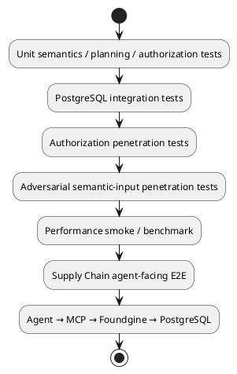

# Supply Chain E2E — AI Agent → MCP → Foundgine → PostgreSQL

A reproducible end-to-end supply-chain benchmark exercising the Foundgine layers from an agent-like bot through MCP, semantic modeling, authorization, planning, execution and PostgreSQL.

## Flow

AI agent bot → MCP → Foundgine capability boundary → semantic model → authorization → semantic planner → execution service → Npgsql → PostgreSQL.

The bot supports up to five customer identities plus Bob, Carol, Dave and Admin, and deliberately mixes valid, invalid and unauthorized operations. The benchmark verifies that denied requests do not mutate PostgreSQL and that successful mutations produce the expected state. The execution path now explicitly lowers semantic plans to Foundgine ExecutionIR before the PostgreSQL boundary, with a plan fingerprint included in receipts.

## Actors

- Alice — Customer; own orders/customer-visible product and shipment reads; create/cancel own orders.
- Bob — Customer Service / Purchasing; customer/order/shipment reads, order cancellation, and the ambiguity-resolution `find_top_supplier_overdue_orders` capability (see below).
- Carol — Warehouse Operator; inventory and shipment operations.
- Dave — Procurement; suppliers/products/inventory operations.
- Admin — unrestricted.

## First vertical slice

`PlaceOrder` is the high-assurance mutation:

1. actor authorization
2. customer ownership check
3. product resolution
4. positive quantity validation
5. inventory availability check
6. server-side price calculation
7. atomic order + order_items + inventory decrement
8. idempotency/replay protection
9. receipt/evidence

Queries additionally exercise relationship traversal such as Customer → Orders → OrderItems → Product and Product → Supplier/Category/Inventory.

## Current coverage

MCP capabilities include capability discovery, customer/order/product/shipment reads, inventory reads and writes, supplier/product/customer listing, order creation/cancellation, shipment creation/status updates, the ambiguity-resolution `find_top_supplier_overdue_orders` capability, and the high-assurance `PlaceOrder` transaction. Order fulfillment records its warehouse allocation so cancellation restores inventory to the correct warehouse.

## Ambiguity resolution: "top supplier in `<state>`"

The [Foundgine walkthrough](../../../docs-site/walkthrough/index.html) traces one request — *"show me overdue purchase orders from our top supplier in Texas"* — through every layer, including the step where **"top supplier" is not a database key** and has to be resolved through ranked candidates and evidence before anything downstream may execute. `find_top_supplier_overdue_orders(actor, state, supplierName?)` brings that exact case into this benchmark, and the seeded fixture is built so all four of its outcomes are exercised:

| `state` / args                         | Suppliers                                                | Outcome                                                                                                                                                                                                              |
| --------------------------------------- | --------------------------------------------------------- | ------------------------------------------------------------------------------------------------------------------------------------------------------------------------------------------------------------------ |
| `TX`                                    | Acme Industrial (482,000) > Globex Components (210,000)    | **Calculated evidence → execution.** The top candidate is unambiguous, so resolution binds the graph to Acme, authorizes it, and executes the overdue-purchase-order query, returning rows plus evidence (rank, margin over the runner-up, plan fingerprint). |
| `CA`                                    | Northstar Supply (300,000) = Southline Parts (300,000)      | **Candidates, no assurance → ask, don't guess.** The two suppliers tie for "top", so resolution stops before authorization or execution and returns `status: "clarification_needed"` with the tied candidates and suggested refinements (name the supplier, give a tiebreak criterion, narrow the region). |
| `NY`                                    | none seeded                                                | **No candidates at all.** Returns `status: "not_found"` — there is nothing to resolve, so nothing is authorized or executed either.                                                                                 |
| `CA` + `supplierName: "Northstar Supply"` | same tie as above, but the caller now names one directly     | **Closing the loop.** The agent has already been told the candidates are tied and comes back with a specific name instead of leaving Foundgine to guess. The name is validated against the real candidate set (an unmatched name still returns `not_found`, never a guess) and, once matched, resolves and executes exactly like the `TX` case, with `resolvedBy: "explicit-name"`. |

Every `resolved` response also demonstrates field-level authorization from step 7 of the walkthrough: `Supplier.NegotiatedCost` is a commercially sensitive field that is stripped from the response — and listed under `deniedFields` — for every actor except Admin, regardless of the fact that the capability call itself was allowed.

The agent workload calls this capability with a random choice among all four shapes above on each occurrence, so a single run exercises every outcome. Bob (purchasing/customer service) and Admin are authorized for it; every other actor is expected to be denied at the MCP boundary, same as the rest of this benchmark's authorization matrix.

### Other cases worth adding later

A few more walkthrough-shaped cases that would extend this further, not yet implemented:

- **Stale authorization binding.** Simulate an actor's role or grant changing between plan binding (step 8) and execution (step 10-11), and assert the fingerprint mismatch fails the request closed instead of running a stale decision.
- **Near-tie below a confidence threshold.** Today "ambiguous" means an exact numeric tie. A more realistic case is two candidates close enough (e.g. within 5%) that guessing is risky even without an exact tie — worth its own threshold-based `clarification_needed` variant.
- **Retrieval strategy variety.** This capability only uses the `relational` strategy. Adding a `fuzzy`/`fullText` retrieval case (e.g. "the Nor supplier" resolving to Northstar via `pg_trgm`) would exercise `Foundgine.Sql`'s other retrieval strategies described in `docs/ARCHITECTURE.md`.
- **Multi-field ambiguity.** Combine an ambiguous supplier with an ambiguous product/category reference in the same request, to check that the graph carries and resolves more than one candidate node at once.

## Run

```powershell
cd benchmarks/AgentEndToEnd/SupplyChain
$env:SUPPLY_CHAIN_CUSTOMERS="5"
$env:SUPPLY_CHAIN_STEPS="25"
$env:SUPPLY_CHAIN_SEED="20260823"
./run-supply-chain.ps1
```

The runner starts PostgreSQL and the Foundgine MCP service, seeds the graph, executes a stochastic agent workload, and writes `reports/supply-chain-report.json` and `reports/supply-chain-report.md`.
It then runs the existing `Foundgine.SupplyChain.PenTest` GraphQL and MCP penetration-test cases against the **same PostgreSQL instance** and merges their xUnit TRX timings into the same JSON/Markdown report. This avoids maintaining a second copy of the security scenarios while making every PenTest case measurable in the E2E evidence.

## Publish the report to the website

After a successful run, publish the generated report into the website asset folder:

```powershell
./publish-supply-chain-report.ps1
```

This copies the JSON and Markdown report to `docs-site/assets/agent-benchmark/supply-chain/` and writes a publication manifest. The website page at `docs-site/agent-benchmark/supply-chain/index.html` reads the JSON directly and renders the latest published run.


## How this fits into the Foundgine story

The Supply Chain benchmark is deliberately the **end of the story**, not the beginning. It takes the lower-level guarantees already tested by the repository and places them in a realistic agent-facing business workflow:



The benchmark therefore answers a different question from a raw throughput test: **can an application expose useful business capabilities to an agent without handing the agent authority over the application's data-access and execution rules?**

### What is inside the boundary

The agent chooses a capability and supplies structured arguments. MCP exposes the application capability surface. Foundgine resolves the request against the semantic model, applies authorization and validation, builds the semantic plan, lowers it through ExecutionIR, and hands the executable boundary to the provider. PostgreSQL remains the system of record.

The benchmark deliberately exercises the failure paths as well as successful paths. Unauthorized or invalid requests are expected to fail, and the benchmark checks that rejected operations do not create unintended database state.

### Verification status

The repository CI treats the following as release-quality gates: **unit tests, PostgreSQL integration tests, authorization penetration tests, adversarial semantic-input tests, and a real performance smoke test**. The Supply Chain E2E is an additional stateful product benchmark. See [`VERIFY-GATES.md`](VERIFY-GATES.md) for the exact gate definitions and local commands.

Do not read the Supply Chain report as a replacement for those gates. It is the final application-level demonstration that brings them together.
