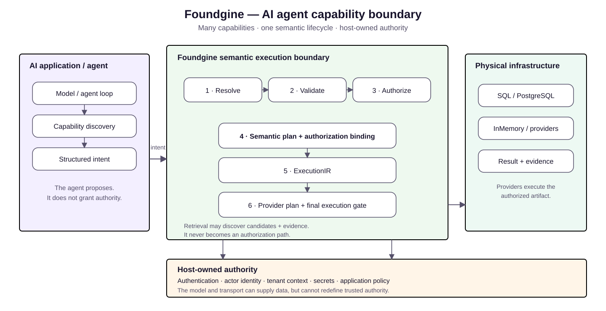

# AI Agents with Foundgine

Foundgine gives AI agents a controlled application capability surface without giving the model database authority.

## The boundary

The agent proposes structured intent. Foundgine resolves, validates, authorizes, plans and executes it through the same boundary used by other callers.

## Capability discovery is advisory

Discovery describes what the application exposes. It does not grant permission. The server evaluates authorization again for every actual operation.

## Host-owned security

Authentication, actor identity, tenant context, secrets and model orchestration remain host responsibilities.

## Go deeper

Read the repository [AI agent guide](https://github.com/CristianBarragan/Foundgine/blob/main/docs/AI-AGENT.md).

## Continue

[Security](../security/index.html) → [Samples](../samples/index.html)
