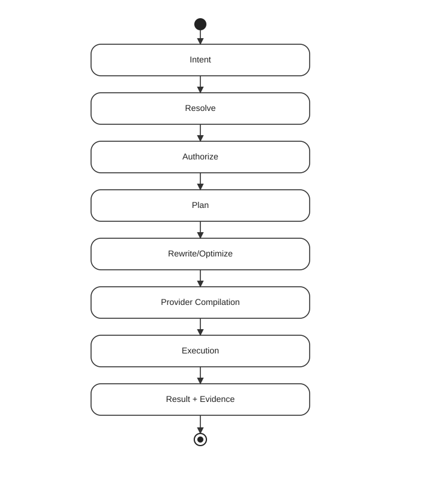
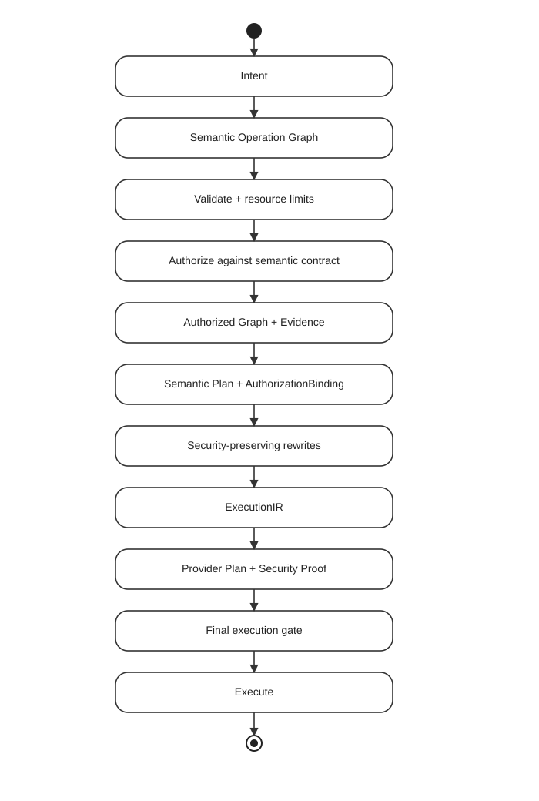

# Foundgine Architecture

## Core pipeline

## Semantic model

Application-facing meaning: entities, fields, relationships, capabilities and authorization. It is provider-independent.

## Metadata

Structural facts can be discovered from application declarations and AOT-generated metadata without making semantic code depend on runtime reflection.

## Planning

`Foundgine.Core.Semantic.Planning` produces provider-independent plans and `ExecutionIR`. Logical filters, ordering, pagination, traversal and aggregation stay logical; physical execution choices belong to providers.

## Execution

`Foundgine.Core.Execution` is the provider boundary for compilation/dispatch, security conformance, materialization and execution evidence.

## Providers

`Foundgine.Providers.Storage.Sql` provides SQL/PostgreSQL execution. `Foundgine.Providers.Storage.InMemory` provides a small non-SQL implementation for provider-independence testing.

`Foundgine.Providers.Storage.Sql` also answers semantic candidate-retrieval requests — ranked matches for an ambiguous reference — through one `RetrievalStrategy` contract backed by several PostgreSQL mechanisms: relational lookups, `pg_trgm` fuzzy matching, native full-text search, optional `pg_search`/BM25, and optional Apache AGE graph-similarity (a Cypher query over a semantic relationship). `Search` and `GraphSimilarity` only activate when their respective extensions are installed; `Vector` retrieval is reserved for a future `pgvector` provider. Whichever strategy runs, the result is candidates and evidence, not a bypass of semantic resolution or authorization.

## Semantic Operation Graph → Authorization → Plan Binding → Execution

The semantic operation graph is the canonical security object for a resolved request. Authorization evaluates the complete graph before provider-specific planning begins.

`SemanticPlanAuthorizationBinding` records the exact semantic contract fingerprint and authorization-decision fingerprint that produced the plan. Rewrites must preserve that binding. `ExecutionIR` and the provider plan inherit it, while the final security gate checks the exact provider artifact against the exact execution IR.

> **An executable provider artifact must remain traceably bound to the semantic contract and authorization decision that produced it.**

Retrieval mechanisms such as `pg_trgm`, full-text search, optional BM25 and optional Apache AGE graph similarity may produce candidates and evidence for semantic resolution, but they cannot grant authority or bypass authorization.

## Adapters

JSON, GraphQL, MCP and AI integrations translate caller requests into Foundgine operations. They do not become the authority over execution.

## Lexical grounding and grounding decisions

Free-form language is resolved through a provider-neutral candidate boundary (`Foundgine.Providers.Storage.Elasticsearch`, `Foundgine.Providers.Storage.PostgresVector`): every token is scored across semantic kinds, and the highest score is a hypothesis, not truth — the semantic graph decides whether a path is legal.

A legal path is not automatically the intended one, though: the same expression can be structurally valid against two different meanings at once (a different field, value, relationship, or root entity), and retrieval score alone can't break that tie safely. `SemanticLexicalResolver.Ground` returns a `GroundingDecision` that tells competing *meanings* apart from duplicate *evidence for the same meaning*, and requires clarification instead of silently authorizing the top-scored candidate when two or more meanings remain genuinely tied. See [Grounding decisions](../../docs/GROUNDING-DECISIONS.md).

## Next

Read [How it works](../how-it-works/index.html) next.
