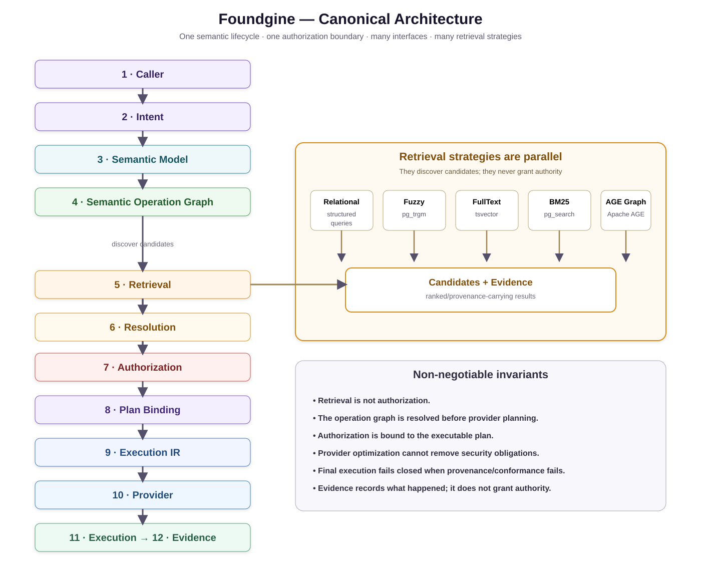

# Foundgine Architecture

## Canonical lifecycle

`Caller → Intent → Semantic Model → Semantic Operation Graph → Retrieval → Resolution → Authorization → Plan Binding → ExecutionIR → Provider → Execution → Evidence`

## Boundaries

- **Core:** application meaning and provider-independent contracts.
- **Runtime:** resolution, authorization, planning coordination and execution orchestration.
- **Providers:** concrete physical infrastructure and agent/tool integrations.
- **Extensions:** optional framework adapters such as GraphQL.

## Security rule

Retrieval produces candidates and evidence. It does not grant authority. Authorization happens against the resolved semantic operation before provider-specific execution is approved.

## Plan binding

The executable artifact remains bound to the semantic contract and authorization decision that produced it. Provider optimization cannot remove those obligations.

## Continue

[How it works](../how-it-works/index.html) → [Security](../security/index.html) → [Packages](../packages/index.html)
