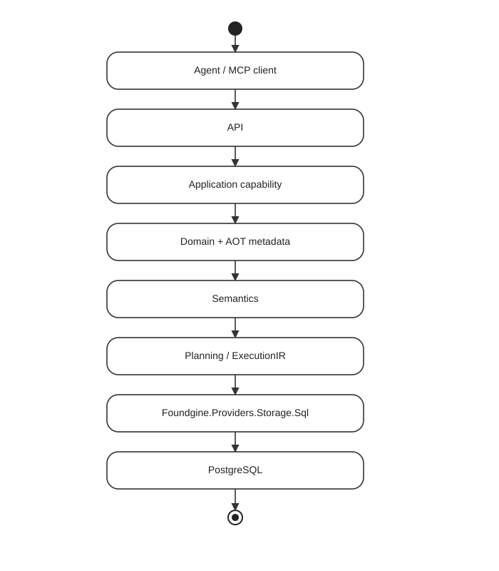

# Get started with Foundgine

The canonical `Foundgine.SupplyChain` sample is the fastest way to understand the architecture in a real application.

## What you will run



## Prerequisites

- .NET 9 SDK
- Docker / Docker Compose
- a clone of the Foundgine repository

## Start PostgreSQL

Use the repository's supplied PostgreSQL Compose configuration.

```bash
docker compose -f docker-compose.postgres.yml up -d
```

## Run the sample

The exact command and configuration are maintained in `samples/Foundgine.SupplyChain/GUIDE.md`. The important part of the exercise is following one request through the layers rather than memorizing a command sequence.

## Step-by-step tutorials

Two written tutorials walk through the Supply Chain samples file by file, including the required setup for each step:

- **Starter** — [Building the Starter, step by step](https://github.com/CristianBarragan/Foundgine/blob/main/samples/Foundgine.SupplyChain/SupplyChain-Starter-Tutorial.md) builds `Foundgine.SupplyChain` from an empty folder; [Foundgine Supply Chain, Explained](https://github.com/CristianBarragan/Foundgine/blob/main/samples/Foundgine.SupplyChain/Foundgine-SupplyChain-Explained.md) covers the *why* behind each file and package.
- **Advanced** — [`docs/00-Overview-And-Setup.md`](https://github.com/CristianBarragan/Foundgine/blob/main/samples/Foundgine.SupplyChain.Advanced/docs/00-Overview-And-Setup.md) in `Foundgine.SupplyChain.Advanced` is the index for five numbered docs covering claims/authorization, high-assurance read scenarios, ambiguity ("grounding") resolution, retrieval strategies, and adversarial security testing — each tied to the exact test files that prove it.

See the [Samples](../samples/index.html) page for more on how the two samples relate.

## Layer-by-layer

### API

Transport handling only. It should not construct SQL or become the authorization authority.

### Application

Business capabilities and use-case orchestration. This is where application ownership of the operation remains visible.

### Domain

Domain types and business concepts.

### AOT metadata

`Foundgine.Providers.Aot.Generator` turns compile-time declarations into generated metadata, reducing runtime discovery and supporting Native AOT-friendly applications.

### Semantics

Structural metadata becomes application meaning: semantic entities, fields, relationships, capabilities and authorization.

### Planning

Semantic operations become provider-independent plans and `ExecutionIR`. Physical SQL is not part of this layer.

### Execution / provider

`Foundgine.Core.Execution` owns the final execution boundary. `Foundgine.Providers.Storage.Sql` lowers the work to parameterized SQL and executes it through ADO.NET/PostgreSQL.

### MCP

MCP exposes capabilities to an external caller. It remains an adapter; host-owned identity and authorization stay outside the protocol.

### Testing

The repository tests each seam independently, then composes them into PostgreSQL and end-to-end scenarios.

## Next

Read [What is Foundgine](../what-is-foundgine.html) next.
