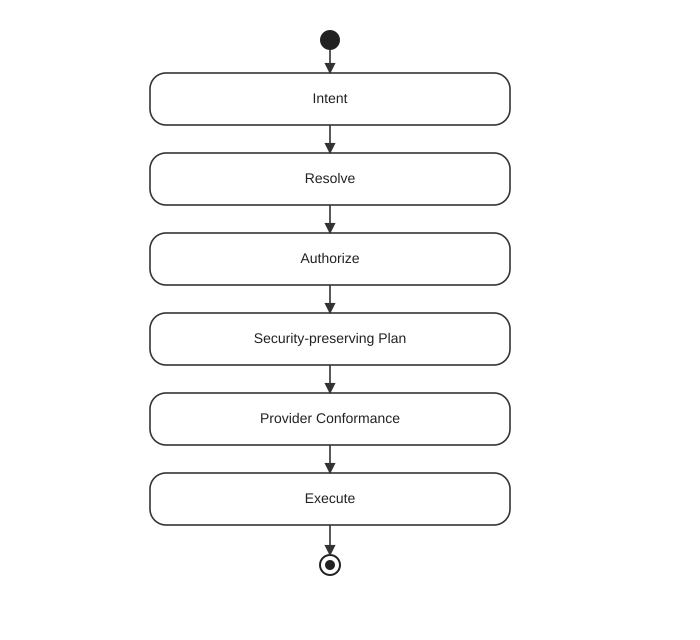

# Foundgine Security

Foundgine treats intent as untrusted and carries authorization obligations into planning and provider execution.

## Invariant

Capability discovery is descriptive. Caller-supplied authorization claims cannot widen trusted authority. Provider conformance is part of the execution boundary.

## Go deeper

- [Authorization](https://github.com/CristianBarragan/Foundgine/blob/main/docs/AUTHORIZATION.md)
- [Security model](https://github.com/CristianBarragan/Foundgine/blob/main/docs/SECURITY.md)
- [Security PenTest sample](../samples/pentest/index.html)

## Continue

[AI agents](../ai-agents/index.html) → [Samples](../samples/index.html)
