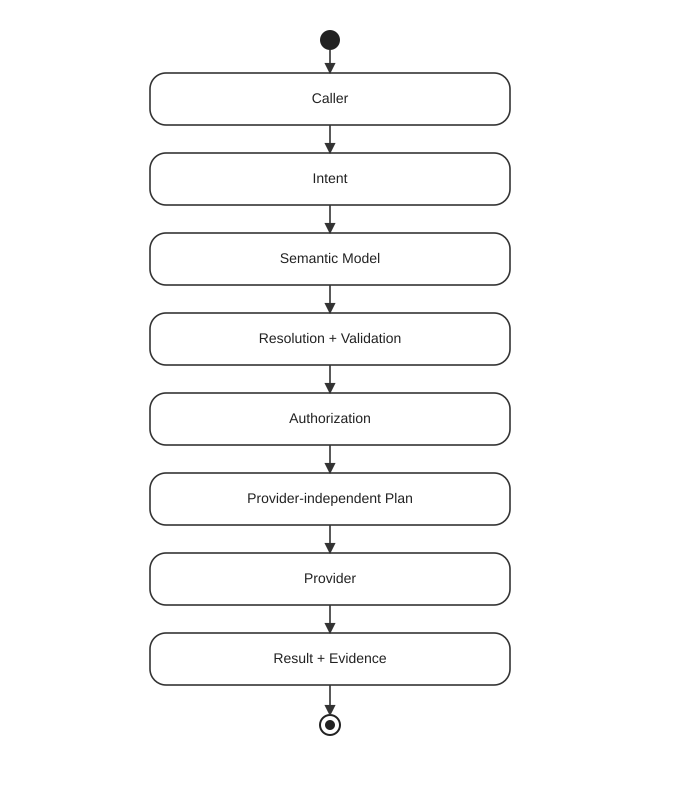

# What Is Foundgine?

Foundgine is a programmable semantic execution platform for .NET. It separates caller intent from application authority and physical execution.

## The problem

Applications increasingly have many callers: APIs, GraphQL, automation, internal services and AI agents. Without a common execution boundary, each caller can duplicate validation, authorization, orchestration and data access.

## The Foundgine model

## Semantic versus persistence models

A persistence model describes storage. A semantic model describes what the application intentionally exposes. They can differ in fields, relationships, capabilities and authorization.

## Why it matters for AI

An AI model can propose structured intent without becoming the authority over database schema, tenants, credentials or business invariants. Foundgine re-evaluates the request inside the application-controlled semantic and authorization boundary.

An agent is also the clearest case for *why* a shared boundary matters: an agent with many tools can otherwise end up with as many independent execution and security surfaces, each only as correct as the tool that implements it. Routing every tool through the same semantic and authorization path — read or write — means that decision is made once, consistently, regardless of which tool or transport the request arrived through.

## What Foundgine is not

Foundgine is not an ORM replacement, database, GraphQL server, identity provider, authorization server, workflow engine or general autonomous-agent framework.

## What, how, where — and what it's designed for

**What:** a semantic execution boundary between caller intent and physical execution.

**How:** every caller converges on one pipeline — Intent → Semantic Model → Resolution (including lexical grounding) → Authorization → Provider-independent Plan → Execution + Evidence.

**Where:** below the transport (GraphQL, JSON, MCP, AI, application code), above the provider (SQL, InMemory, or others). It replaces the layer where a controller or tool handler would otherwise hand-roll authorization and query construction — it does not replace the provider or the transport.

**What it's designed for:** applications where more than one kind of caller needs to reach the same data and operations, and where getting authorization or meaning wrong would be costly. The value scales with the number of callers, the consequence of a wrong decision, and how much of the input is free-form language rather than a fixed shape.

## Categories of applications

- **Multi-transport enterprise backends** — one hardened semantic/authorization core exposed through GraphQL, MCP, and JSON at once.
- **AI-agent tool execution boundaries** — an agent proposes structured intent; Foundgine stays the authority over what it means and whether it's allowed.
- **High-assurance mutation workflows** — writes where a wrong authorization decision is expensive enough to justify explicit dependency ordering, replay protection, and an execution receipt.
- **Composite / cross-domain application models** — a semantic model assembled from more than one underlying physical concept.
- **Free-form / natural-language query surfaces** — a search box, chat interface, or open-ended agent, where [lexical grounding](../docs/LEXICAL-GROUNDING.md) resolves language against the contract without letting retrieval relevance become authorization.

See [What Foundgine is designed for](../docs/APPLICATION-CATEGORIES.md) for the full breakdown, with the sample project that proves each category.

## Ambiguity is a first-class result, not a silent guess

Free-form language can be structurally valid against more than one meaning at once — "active customers" can legally mean an enabled account or a customer with a recent order, and a graph-constrained path can't tell those apart on its own. A resolver that always returns the top-scored candidate will occasionally execute a confidently wrong interpretation: a perfectly authorized misunderstanding.

Foundgine's `SemanticLexicalResolver.Ground` returns a `GroundingDecision` instead of just a winner: it commits when interpretations agree on meaning (even if they came from different retrieval evidence or graph routes), and requires clarification when they genuinely disagree. See [Grounding decisions](../docs/GROUNDING-DECISIONS.md) for the full explanation and a worked example.

## Next

Read [Architecture](architecture/index.html) next.
