# AI agent integration

Foundgine's AI integration is deliberately small: it exposes semantic execution as tools without making Foundgine depend on a particular LLM provider or agent framework.


## AI agents use the same canonical lifecycle

An agent is another untrusted caller. It does not receive a special execution path:

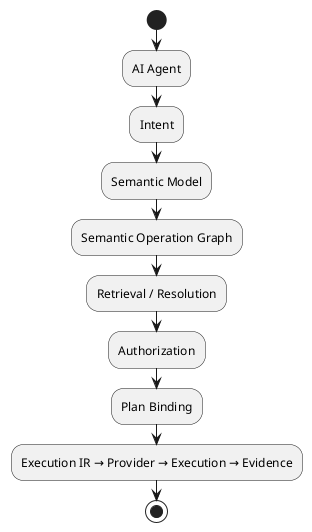

Capability discovery is descriptive. Search results, model output and tool arguments remain untrusted until the normal semantic and authorization stages accept them.

## Architecture

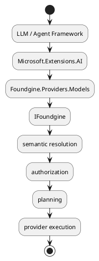

The model is an untrusted producer of intent.

## What `Foundgine.Providers.Models` provides

The package contains:

- `FoundgineAiToolset`;
- `FoundgineAiAgent`.

The toolset exposes semantic capability discovery and query execution as `AIFunction`s.

The agent helper runs a bounded function-calling loop using `Microsoft.Extensions.AI`.

## Capability discovery

An agent can first discover the semantic capabilities available to its execution context.

The flow is:

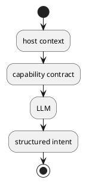

Discovery is descriptive.

The request is still authorized when executed:

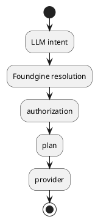

## Security boundary

Never let model-generated tool arguments choose:

- identity;
- tenant;
- audience;
- warrant;
- provider;
- connection string;
- authorization policy.

The host supplies the trusted execution context.

## Example shape

```csharp
var toolset = new FoundgineAiToolset(
    foundgine,
    executionContextFactory);

var tools = toolset.CreateTools();
```

The application supplies its preferred `IChatClient` and can then use the returned tools in its agent loop.

## `FoundgineAiAgent`

The agent helper uses Microsoft.Extensions.AI function invocation to support:

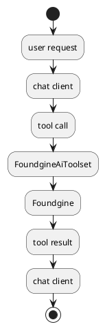

The loop is bounded by tool-iteration/resource controls.

It is not a general autonomous-agent runtime.

## What remains application-owned

The host/application owns:

- model/provider credentials;
- model selection;
- system prompts;
- conversation memory;
- business approval;
- authentication;
- identity/tenant context;
- rate limiting;
- deployment;
- observability.

Foundgine only owns the semantic execution boundary.

## Prompt injection

Foundgine cannot make arbitrary natural-language instructions trustworthy.

The security strategy is instead to make the execution authority independent of the model:

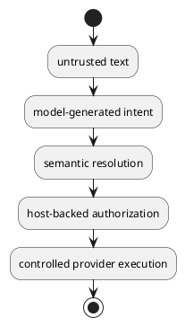

Malicious text in data must not be able to grant the model new Foundgine authority.

Applications still need model/application-level prompt-injection defenses.

## Why not SQL generation?

The intended pattern is:

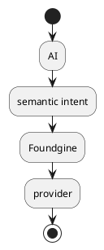

not:

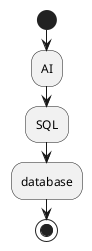

This keeps database credentials and physical schema outside the model's control.

## Relationship to MCP

AI and MCP are independent adapters over the same runtime:

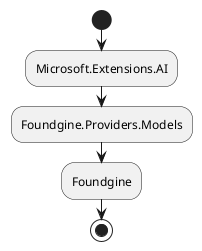

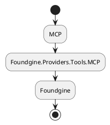

An application can use either or both.

## Relationship to GraphQL/JSON

GraphQL and JSON are also intent adapters.

The important property is convergence:

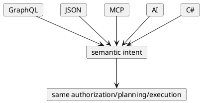

## Current scope

This integration does not claim to be:

- an agent framework;
- an LLM gateway;
- an autonomous workflow engine;
- a memory/vector system;
- a model safety platform.

It is a controlled AI tool integration.

## Related source package

See `src/Foundgine.Providers/Foundgine.Providers.Models/README.md` for the package-level API and security contract.

---

Next: [PostgreSQL E2E](POSTGRES-E2E.md)
