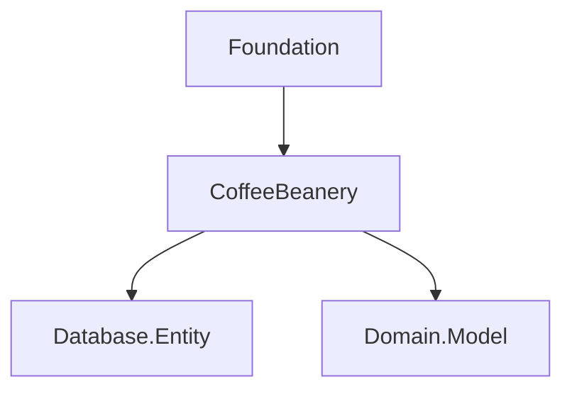

# Foundation

## Purpose

The Foundation project defines the core contracts that every CoffeeBeanery component depends on.

It intentionally has no infrastructure concerns and serves as the architectural root of the framework.

## Design Principles

- Dependency inversion
- AOT-friendly
- Zero infrastructure dependencies
- Stable public contracts
- Compile-time first

## Responsibilities

- Core interfaces
- Shared abstractions
- Runtime contracts
- Metadata contracts
- Marker interfaces

## Dependency Rules

Foundation must never reference ASP.NET Core, EF Core, HotChocolate, Dapper, or Npgsql.

