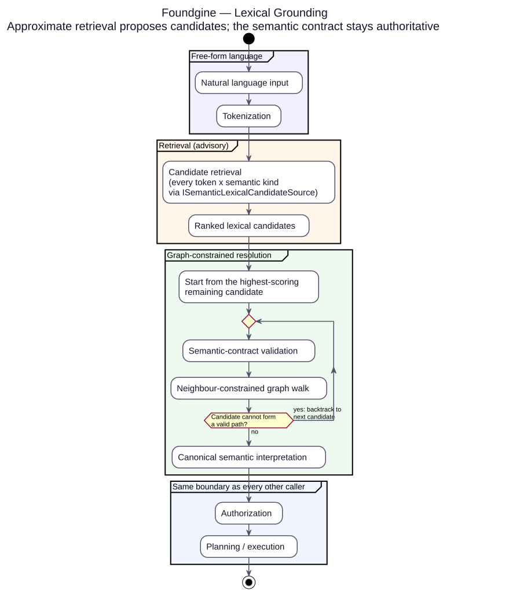
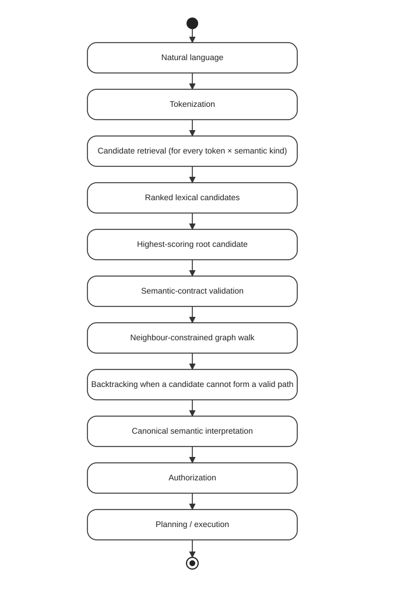
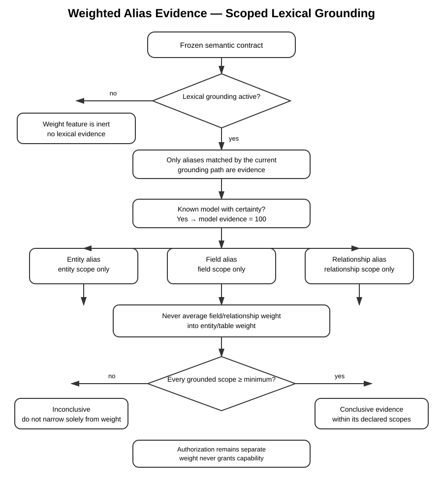

# Lexical grounding

Foundgine can resolve free-form language without requiring complete sentences or
predefined query templates. The semantic contract remains authoritative; an
approximate retrieval provider only proposes candidates.

## Canonical flow

<p align="center"></p>



For each token, the retrieval boundary can consider:

- Entity
- Node
- Relationship
- Traversal
- Field
- Value
- Operation

The highest retrieval score is the **first hypothesis**, not truth. A lower
scoring candidate can win if it forms a valid semantic path while the higher
scoring candidate cannot.


### Weighted aliases: evidence strength without authority

Aliases can optionally carry an **evidence weight from 1 to 100**. The weight is
now part of the grounding evidence model, while remaining separate from the
retrieval/graph interpretation score.

The resolver has one explicit policy switch:

```csharp
new SemanticLexicalResolver(
    contract,
    source,
    minimumAliasWeight: 80);
```

When `minimumAliasWeight` is omitted, alias weights are measured and exposed as
diagnostic evidence but do not change commitment. When it is configured,
retrieval/graph score still determines which interpretation ranks first; the
alias weight does **not** participate in that ranking equation. Instead, the
selected interpretation must satisfy the configured lexical-evidence threshold
before Foundgine may commit it.

The resulting flow is:

```text
lexical candidate
    ├── retrieval score
    ├── matched alias evidence
    └── semantic identity
             ↓
      interpretation
    ├── InterpretationScore
    └── AliasEvidence
             ↓
      GroundingDecision
       ├── Committed
       └── RequiresClarification
```

A unique interpretation with a declared alias below the configured minimum is
therefore **not committed**. The decision exposes the measured alias evidence
and returns `RequiresClarification`. This is a grounding commitment policy,
not an authorization decision.

There are three independent evidence scopes, plus one distinct provenance
signal:

- **Model provenance** — if the model has already been established with
  certainty by an earlier processing step, Foundgine records this as
  `ModelResolutionEvidence.KnownWithCertainty`, a distinct non-numeric
  category rather than a value on the same 1–100 scale as alias weight. This
  is deliberate: model certainty and declared alias evidence answer different
  questions, so they cannot be combined (e.g. via `max`) even by accident. An
  obsolete `ModelWeight` (`int?`, `100` when known-with-certainty) remains
  only as a compatibility projection for existing callers.
- **Entity scope** — an entity alias contributes only to that entity.
- **Field / relationship scope** — a field alias contributes only to that field,
  and a relationship alias only to that relationship.

A field weight of `50` is therefore **not** a `50` for its containing entity.
Likewise, a relationship weight cannot raise the entity's evidence.

If several weighted aliases contribute to the same semantic identity in one
grounding interpretation, the aggregation rule is **maximum declared weight**.
Repeated retrieval evidence does not inflate the value, and a weaker alias
cannot dilute a stronger alias for the same identity.

The evidence API uses an explicit three-state status:

```csharp
AliasEvidenceStatus.NotApplicable
AliasEvidenceStatus.Sufficient
AliasEvidenceStatus.Insufficient
```

`NotApplicable` means that no weighted lexical alias participated. It does
**not** mean that the request was positively proven. The older
`IsConclusive` boolean remains only as a compatibility projection and should
not be used by new callers.

Every evidence result also carries `ContractFingerprint` — the fingerprint of
the exact frozen semantic contract it was measured against, computed from
declarations *and* their declared alias weights. Changing a declared alias
weight changes the contract's fingerprint, since weight is security-relevant
evidence rather than decorative metadata. This lets an audit trail prove
which contract version a `Sufficient`/`Insufficient` verdict corresponds to.

The weight can be declared on an entity, field, or relationship alias:

```csharp
[FoundgineAlias("Vendor", Weight = 95)]
[FoundgineAlias("Seller", Weight = 90)]
public sealed record Supplier(...);

[property: FoundgineAlias("State", Weight = 85)] string Country
```

For applications that use the manual semantic builder, the equivalent APIs are
`Alias("Vendor", 95)`, `FieldAlias(..., "State", 85)`, and
`RelationshipAlias(..., "vendor", 85)`.

The frozen semantic contract builds case-insensitive alias indexes for entity,
field, and relationship declarations. Grounding therefore does not repeatedly
scan the entire semantic model to recover evidence.

Weight remains evidence about vocabulary, not authority. It never grants a
capability and never replaces the authorization boundary.



PlantUML source: [`lexical-grounding-alias-weight.puml`](assets/lexical-grounding-alias-weight.puml)

The advanced Supply Chain sample exercises entity, field, and relationship
alias weights, including scope boundaries and the distinction between lexical
grounding and already-known semantic models. The resolver tests additionally
cover the important disagreement case: a high retrieval score cannot bypass a
configured low alias-evidence threshold.

The important distinction is:

| Signal | Meaning | Can it grant authority? |
|---|---|---|
| Retrieval score | How strongly a provider matched a token; used to rank interpretations | **No** |
| Alias weight | Application-declared evidence strength for a matched lexical declaration | **No** |
| Interpretation score | Retrieval/graph heuristic used to rank complete meanings | **No** |
| Alias evidence policy | Whether the selected interpretation has enough declared lexical evidence to commit | **No** |
| Semantic path | Whether a candidate interpretation is structurally legal | **No** |
| Authorization decision | Whether the caller may execute the resolved operation | **Yes — this is the authority boundary** |

