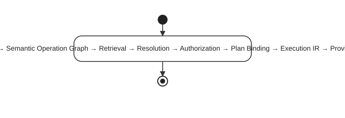
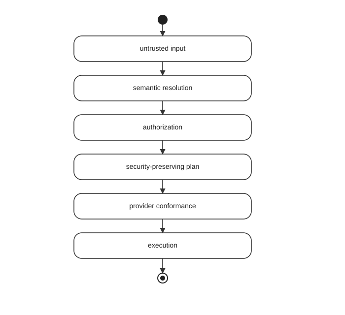

# Foundgine 2.0.0

Foundgine is a **programmable semantic execution platform for .NET**. It creates an application-controlled boundary between structured caller intent and physical execution.

## Canonical lifecycle

Retrieval is candidate discovery, not authorization.

## Core vocabulary

- **Semantic model** — application-defined meaning: entities, fields, identities, relationships, aliases and capabilities.
- **Intent** — what the caller requests, independently of physical SQL/provider operations.
- **Retrieval** — candidate discovery plus evidence; never an authorization decision.
- **Resolution** — selects and validates the intended semantic meaning.
- **Authorization** — determines what the current trusted execution context may exercise.
- **Plan** — provider-independent logical execution.
- **ExecutionIR** — the controlled intermediate execution representation at the provider boundary.
- **Provider** — physical execution implementation.
- **Evidence** — execution/security/plan context such as receipts and fingerprints.

## Adapters and providers

Intent can originate from application code, JSON, GraphQL, MCP or AI tools. These are adapters/consumers of the semantic boundary.

Current providers include `Foundgine.Providers.Storage.Sql` for SQL/PostgreSQL and a deliberately limited `Foundgine.Providers.Storage.InMemory` provider. PostgreSQL retrieval includes relational lookup, `pg_trgm`, native full text, optional `pg_search`/BM25 and optional Apache AGE graph similarity. Vector retrieval is not currently implemented.

## AI

AI may generate structured intent. It does not decide application authority, tenant identity, exposed semantics, credentials, policy or whether security invariants may be skipped.

## MCP

`Foundgine.Providers.Tools.MCP` is a transport/capability adapter. Discovery is advisory. The host supplies trusted security context and every actual request is resolved and authorized.

## Security

The core security boundary is:

Identity, tenant, audience, secrets and other authority remain host-owned.

## Current evidence

The `Foundgine.SupplyChain` sample and AgentEndToEnd benchmark demonstrate an agent-facing business workload through MCP, semantic execution, authorization, ExecutionIR and PostgreSQL. The associated PenTest suite contains 14 deterministic cases: 7 MCP and 7 GraphQL. Benchmark pages separate measured performance from modeled efficiency estimates.

## Packages

- `Foundgine` — runtime facade
- `Foundgine.Core.Abstractions` — stable contracts and identifiers
- `Foundgine.Core.Semantic.Metadata` — structural metadata
- `Foundgine.Core.Semantic` — meaning, intent, resolution, authorization
- `Foundgine.Core.Semantic.Planning` — provider-independent planning and safe rewrites
- `Foundgine.Core.Execution` — ExecutionIR, provider boundary, results and evidence
- `Foundgine.Providers.Storage.Sql` — SQL/PostgreSQL provider
- `Foundgine.Providers.Storage.InMemory` — limited non-SQL provider
- `Foundgine.Providers.Aot` / `Foundgine.Providers.Aot.Generator` — AOT declarations and source generation
- `Foundgine.Core.Serialization` — JSON intent adapter
- `Foundgine.Extensions.GraphQL.HotChocolate*` — GraphQL adapters/execution boundaries
- `Foundgine.Providers.Tools.MCP` — MCP adapter
- `Foundgine.Providers.Models` — `Microsoft.Extensions.AI` integration
- `Foundgine.Runtime.ControlPlane` — optional authority/recovery control-plane infrastructure

## Current release

**2.0.0 · .NET 9**

For implementation truth, use the active source tree, tests, `docs/CURRENT-STATUS.md`, and package READMEs.

## Website navigation

- `/` — Foundgine landing page
- `/case-studies/supply-chain/` — featured Supply Chain case study with capabilities and benchmark evidence
- `/agent-benchmark/supply-chain/` — live/published Supply Chain E2E benchmark report
- `/samples/semantic/` — advanced semantic execution sample
- `/samples/pentest/` — security penetration-test sample
- `/architecture/` — architecture and lifecycle
- `/ai-agents/` — AI/agent boundary
- `/security/` — security model
- `/packages/` — package map
