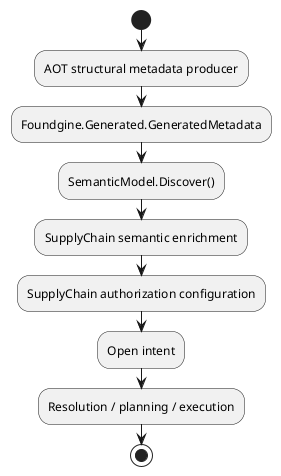
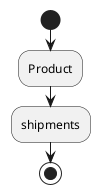
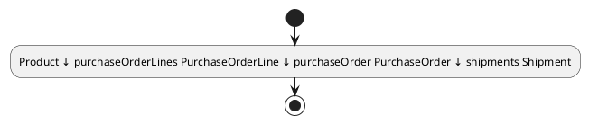

# Foundgine Supply Chain Semantic Showcase

This sample is the architectural proving ground for Foundgine's **Metadata → Semantics → Authorization → Intent** pipeline.

## Architecture



The sample deliberately keeps structural truth out of `SupplyChainSemanticModel`.
The generated metadata describes the 13 entities, their fields, identities and 14
physical relationships. The semantic layer adds only the business-level logical
traversal `Product.shipments`.

### The four boundaries

| Boundary | Responsibility |
|---|---|
| **Metadata** | What exists: entities, fields, identities, storage and relationships |
| **Semantic configuration** | What it means: logical business traversals and other application meaning |
| **Authorization** | What may be exercised by this actor |
| **Intent** | What the caller wants to do |

Generated numeric IDs remain internal metadata identities. Application code resolves
entities, fields and relationships by semantic names and does not maintain those IDs.

## Structural metadata

`Domain/Domain.cs` contains the CLR declarations consumed directly by the AOT metadata producer.
There is no second structural model:

- the domain records are the CLR source observed by the metadata generator;
- `[FoundgineEntity]`, `[FoundgineField]`, and `[FoundgineRelationship]` describe structural facts;
- `Foundgine.Providers.Aot.Generator` emits `Foundgine.Generated.GeneratedMetadata.Registry`;
- `SupplyChainMetadataProducer` exposes that registry as `IMetadataCatalog`;
- `SemanticModel.Discover()` turns that metadata into the base semantic graph.

This is the same producer boundary we want to use for EF/CLR/AOT integrations: a
metadata producer feeds Foundgine rather than a reflection-driven semantic system.

## Semantic enrichment

`Semantics/SupplyChainSemanticModel.cs` starts with:

```csharp
var builder = SemanticModelBuilder.FromMetadata(Metadata);
```

and adds the one genuinely logical concept that cannot be inferred from storage:

```csharp
.Traversal(
    "Product",
    "shipments",
    "purchaseOrderLines",
    "purchaseOrder",
    "shipments")
```

The caller therefore sees:



while resolution expands it into:



Every physical relationship remains visible to authorization and planning.

## Authorization

`Authorization/SupplyChainAuthorization.cs` contains application policy only:
roles, tenant/warehouse predicates, sensitive-field rules, relationship rules and
mutation-specific authorization. It resolves field and relationship identities by
semantic name rather than embedding generated numeric IDs.

That distinction matters because the authorization policy must continue to apply to
every relationship and every intermediate entity in a logical traversal.

## Difficult scenarios

The sample intentionally retains its complex security and mutation coverage,
including recursive BOM traversal and cycles, tenant isolation, warehouse scoping,
sensitive fields, nested mutation identity flow, named mutation operations and
adversarial invariant checks.

The point of this sample is not to make those cases simpler. It is to prove that the
new generic architecture can express them without falling back to a second,
hand-maintained semantic model.


## Architecture checkpoint — metadata and semantic boundary

The sample no longer carries a generated semantic-topology artifact. Structural topology comes from `Foundgine.Core.Semantic.Metadata`; semantic configuration adds only application meaning; execution limits remain application policy.


### Structural source

There is intentionally no second structural graph in this sample. The CLR domain declarations are the input to the Foundgine AOT metadata generator; the semantic project consumes the generated `IMetadataCatalog` through `SupplyChainMetadataProducer`.
### Structural metadata contract

The AOT producer is a compile-time structural contract, not a passive serializer. Relationship declarations are rejected when the target entity, navigation target, foreign-key property, principal-key property, or key types are inconsistent. This keeps invalid topology out of `GeneratedMetadata.Registry` before semantic discovery or authorization can consume it.

